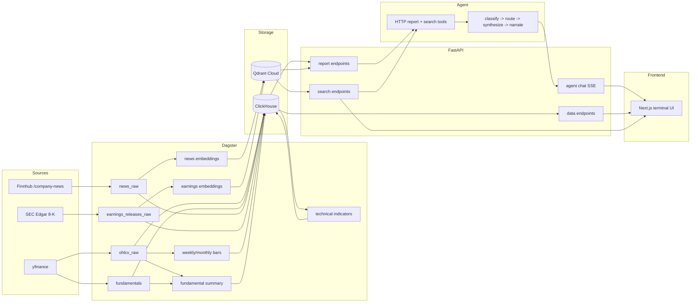

# Equity Data Agent

> Production-style AI/data engineering portfolio project for US equities. The
> agent can write an investment thesis, but it is not allowed to invent or
> calculate financial numbers: Dagster computes them, FastAPI prints them into
> report strings, and LangGraph reasons over those reports. A regression eval
> checks every numeric literal in the answer against the retrieved reports.

[](https://equity-data-agent-ynr2.vercel.app)

<!-- TODO(screenshots): refresh terminal-live.png — captured May 9, predates the mid-June ticker swap, so the watchlist still shows V/JPM/UNH instead of MU/AMD/INTC (contradicts the universe listed below) and predates the RAG/earnings chat cards. Re-capture from the live site per docs/screenshots/README.md. -->


## Highlights

A 30-second scan, split by discipline. Every line is backed by a section below.

**Data engineering**

- Medallion ClickHouse warehouse (`equity_raw` -> `equity_derived`), 28 idempotent migrations, all `ReplacingMergeTree` with `FINAL`/`argMax` read paths.
- Dagster asset graph: 17 technical-indicator columns across three timeframes, 20+ fundamental ratios, and two RAG embedding corpora (news + SEC 8-K).
- 37 domain-bounded asset checks (the dbt-test equivalent) **plus Pandera source-boundary contracts** that route bad rows to an auditable reject sink.
- Data observability: per-ticker freshness, volume/distribution and anomaly checks on a Grafana data-health dashboard, with the Dagster asset graph as lineage.

**AI engineering**

- LangGraph agent: 9 response shapes, a router with a deterministic clarify step, and multi-turn continuity via a checkpointer.
- Grounded RAG over **news + SEC-8K earnings** corpora — hybrid dense+BM25 retrieval, Cohere reranking, targeted-event routing, streamed provenance.
- Layered eval suite: numeric grounding, golden-set regression, tool-call correctness, dialogue quality, **IR retrieval metrics (recall@k / MRR / nDCG)**, and an **LLM-judged RAGAS + G-Eval** harness.
- LiteLLM provider routing with a fallback chain and per-node model tiering; every request is a Langfuse trace with a prompt-version hash.

## Try It

Live app: **[equity-data-agent-ynr2.vercel.app](https://equity-data-agent-ynr2.vercel.app)**

Good demo prompts:

- `Give me a balanced thesis on NVDA`
- `Compare MSFT and GOOGL`
- `What's the news sentiment on TSLA?`

The current universe is 10 US equities — a deliberately semis/tech-concentrated
set: NVDA, AAPL, MSFT, GOOGL, AMZN, META, TSLA, MU, AMD, and INTC. The
concentration is a scope choice, not a limitation: it keeps every ticker in
sectors the agent can reason about with shared context (AI/data-center demand,
the semiconductor cycle) rather than spreading thin across unrelated industries.
Data ingests daily after market close.

## Why This Exists

LLMs are useful at synthesis, but unreliable at financial arithmetic. A model
that fabricates RSI, miscomputes YoY growth, or invents a P/E ratio can poison
an otherwise plausible thesis.

This project treats that as an architecture problem:

| Role | Layer | Responsibility |
|---|---|---|
| Worker | Dagster | Fetch data and compute indicators, ratios, aggregations, and embeddings |
| Interpreter | FastAPI | Query ClickHouse/Qdrant and format human-readable report strings |
| Executive | LangGraph | Read reports, choose a response shape, and synthesize the answer |

The agent has no database client, no calculator tool, and no access to raw
tables. It only sees the report text FastAPI gives it.

## What This Demonstrates

| Area | Proof |
|---|---|
| Data engineering | Medallion-layered ClickHouse warehouse (`equity_raw` -> `equity_derived`) across 28 idempotent migrations; Pandera source-boundary contracts gating every ingest; Dagster asset graph computing 17 technical-indicator columns over three timeframes and 20+ fundamental ratios; 37 domain-bounded asset checks (the dbt-test equivalent) plus z-score anomaly detection; a rejected-row sink; news + earnings embeddings in Qdrant |
| AI engineering | LangGraph agent that classifies a question into one of 9 response shapes, plans tools, and synthesizes an answer; grounded RAG over news + SEC-8K corpora with hybrid dense+BM25 retrieval, Cohere reranking, and deterministic targeted-event routing; multi-turn conversation continuity; LiteLLM provider routing with fallback chains and per-node model tiering; prompt-version hashing on every Langfuse trace; a layered eval suite (numeric grounding, golden-set regression, tool-call correctness, dialogue quality, IR retrieval metrics, and LLM-judged RAGAS/G-Eval) |
| Product engineering | Next.js 16 app with watchlist, ticker detail, charting, fundamentals, news, and persistent chat panel |
| Production ops | Hetzner Docker Compose backend, Vercel frontend, Cloudflare named tunnel, health checks, autoheal, observability-smoke deploy gate with auto-rollback, alerts, runbooks |
| Engineering process | 22 ADRs, 7 phase retros, 412 merged PRs, 1,200+ tests, security scanners, deploy gates, model bench history |

Badges and counts are supporting evidence, not the point:


## Architecture



The `classify -> route -> synthesize -> narrate` flow above is the spine, and the
agentic boundary is the load-bearing constraint: the agent only ever calls HTTP
tools that return report text — no database client, no raw tables, no calculator.
The two discipline sections below go deeper; the fuller system description lives
in [`docs/architecture/system-overview.md`](docs/architecture/system-overview.md).

## AI Engineering

The agent is a controllable graph, not a single prompt — routing, retrieval, and
evaluation are each first-class.

- **Intent routing.** `classify` sorts each question into one of 9 response
  shapes (thesis, quick-fact, comparison, fundamental, technical, news,
  conversational, follow-up, exploration) with a heuristic-first, LLM-fallback
  classifier. A router then picks the path: ambiguous asks (missing ticker,
  missing second ticker for a comparison, a follow-up with no prior turn) go to a
  deterministic clarify step instead of guessing; greetings and capability asks
  skip tool-gathering entirely; broad exploratory asks ("what's interesting about
  AAPL this week?") route to a zero-LLM exploration supervisor.
- **Grounded retrieval (RAG).** Two corpora live in Qdrant — company news
  (headline + body) and SEC 8-K earnings releases. Search is **query-time hybrid**:
  dense vectors (Qdrant Cloud Inference, MiniLM-384) fused with client-side BM25
  via Reciprocal Rank Fusion, then an optional **Cohere cross-encoder rerank**. A
  deterministic keyword gate fires RAG only for targeted events (litigation,
  executive changes, buybacks, recalls, antitrust, M&A, layoffs, SEC actions);
  generic "what's the news?" asks stay on the cheaper canned digest. Retrieved
  sources stream back to the UI as provenance. Contextual retrieval — an
  LLM-written one-sentence parent-release blurb prepended per chunk before
  embedding — is wired for the earnings corpus behind a flag.
- **Provider routing, tiering, and tracing.** LiteLLM hides every provider behind
  one model alias: a one-line model swap, an automatic fallback chain
  (`llama-3.3-70b` -> `llama-4-scout` -> `gpt-oss-120b`) on 429/timeout, and
  per-node tiering (a small `gpt-oss-20b` runs classify/plan, the 70B runs
  synthesize). Every request is a Langfuse trace carrying LangGraph spans, model
  metadata, token usage, and a 10-char prompt-version hash so prompt-quality
  trends are reviewable over time.
- **Multi-turn continuity.** A checkpointer carries a compact transcript across
  turns with per-intent history budgets, so follow-ups reuse prior reports
  without re-fetching.

### Evaluation & hallucination resistance

The precise guarantee is narrower, and more useful, than "the model is never
wrong":

> The agent should not introduce numeric financial claims that are absent from
> the report strings it retrieved.

The project separates two concerns:

| Layer | Guarantee |
|---|---|
| Provenance | Numeric claims must be copied from retrieved reports, not calculated by the LLM |
| Correctness | Evals and judge scores track whether the cited numbers answer the actual question |

Enforcement is layered:

- **Architecture**: [ADR-003](docs/decisions/003-intelligence-vs-math.md) keeps arithmetic in Dagster and report templates, not the agent.
- **Prompt contract**: the system prompt requires every numeric claim to cite its report source.
- **Eval suite** (runnable in CI, with the heavier LLM-judged set off the hot path):
  - numeric grounding — [`hallucination.py`](packages/agent/src/agent/evals/hallucination.py) extracts every numeric literal and checks it against the retrieved reports;
  - golden-set regression — [`golden_set.py`](packages/agent/src/agent/evals/golden_set.py): 41 curated questions across all 10 tickers plus a cross-ticker case;
  - tool-call correctness — [`tool_calls.py`](packages/agent/src/agent/evals/tool_calls.py);
  - dialogue quality — [`dialogue_eval.py`](packages/agent/src/agent/evals/dialogue_eval.py): a 5-axis LLM-as-judge over multi-turn fixtures;
  - retrieval quality — [`retrieval_eval.py`](packages/agent/src/agent/evals/retrieval_eval.py): deterministic, LLM-free IR metrics (recall@k / MRR / nDCG via `ir-measures`) over both Qdrant corpora;
  - LLM-judged generation — [`deepeval_eval.py`](packages/agent/src/agent/evals/deepeval_eval.py): a RAGAS set (faithfulness, answer/context relevancy, context recall) plus a custom G-Eval, run nightly/on-dispatch;
  - RAG routing — [`news_search_eval.py`](packages/agent/src/agent/evals/news_search_eval.py): checks that semantic search fires only on the questions that warrant it.

Most recent clean-window run of the 41-question golden set, production model
(`groq/llama-3.3-70b-versatile`):

| Metric | Result |
|---|---|
| tool_call_ok | 40/40 |
| hallucination_ok | 38/40 |
| cosine vs. reference | 0.41 |

Both hallucination flags were `*-news-sentiment` questions, and both turned out to
be **false positives in the scorer** — it was splitting glued magnitude units
(e.g. `$2.5T`, `$14B`) and treating the fragment as an unsupported number. The
fix sharpened the scorer rather than loosening the contract
([#411](https://github.com/noahwins-ng/equity-data-agent/pull/411)). The point is
that the eval itself stays under test, not just the agent. An LLM-as-judge scores
answers on faithfulness, structure, correctness, and analyst logic as a softer
quality signal; cosine similarity against the reference responses is the
harder-to-game cross-check.

The eval earns its place by disqualifying production-candidate models: Qwen3-32B
(fabricated numbers and leaked `<think>` blocks), Gemini-2.5-Flash-Lite (grounding
and tool-call regressions, plus a 20-request/day free-tier ceiling), and
GPT-OSS-120B — which passed the smaller bench, then fabricated a number once the
golden set expanded to cover more news-sentiment questions. The full candidate
comparison and the quality-before-capacity selection rationale live in
[`docs/model-bench-2026-04.md`](docs/model-bench-2026-04.md).

### Where this design breaks at scale

The agent is tuned for a portfolio-scale public demo. Several choices are right
here but would change with usage — naming them is the point:

- **Bench breadth.** Selection rests on one prompt revision × 41 questions —
  directional signal, not a leaderboard; a real model decision would widen the set
  and average over revisions.
- **Free-tier ceilings.** Groq/Gemini free tiers cap throughput (TPD/RPD); real
  traffic means paid tiers or self-hosted inference.
- **Retrieval depth.** Reranking is query-time only (no index-time reranker), and
  a single MiniLM-384 embedder serves both corpora; a larger corpus would want a
  stronger/domain-tuned embedder plus ANN tuning or quantization.
- **No fine-tuning.** Behaviour is prompt- and routing-shaped; a higher bar would
  justify task-specific fine-tuning or distillation.

## Data Engineering

The warehouse follows the standard data-engineering patterns under
Dagster-native names:

- **Medallion layering.** Two ClickHouse databases mirror a bronze ->
  silver/gold split: `equity_raw` holds ingested source data (OHLCV,
  fundamentals, news, SEC 8-K earnings releases), `equity_derived` holds
  everything computed from it — multi-timeframe bars, 17 technical-indicator
  columns across daily/weekly/monthly (RSI, MACD, SMA/EMA, Bollinger Bands, ADX,
  ATR, OBV), and 20+ fundamental ratios. Every derived table is rebuildable from
  raw, so the raw layer is the only thing that must be durable. (Strict bronze
  would persist unparsed API payloads; skipped deliberately at this volume.)
- **Source-boundary contracts.** Each ingestion source has a
  [Pandera `DataFrameSchema`](packages/shared/src/shared/contracts.py) (QNT-259)
  validated before any DB write — the executable spec of the shape the source
  hands us. A two-tier policy: a *schema* violation (renamed/missing column, dtype
  drift, empty frame) hard-fails the partition and pages the run-failure sensor; a
  *value* violation (out-of-range cell) routes that row to the reject sink while
  clean rows proceed. Evolving a contract is a diff-visible commit, same
  discipline as a migration.
- **Tests on the data (dbt-test equivalent).** 37 domain-bounded
  [asset checks](packages/dagster-pipelines/src/dagster_pipelines/asset_checks)
  — the Dagster-native analogue of dbt tests — assert real financial bounds, not
  just non-null, and add z-score volume-spike and price-gap anomaly detection on
  top. They earn their keep: a `pe_in_band` check caught two distinct P/E formula
  bugs that both passed human code review (a near-zero-EPS blowup to a P/E of
  28,545, and a quarterly ratio dividing full market cap by single-quarter income
  instead of TTM). Declining dbt at this scale was a deliberate call
  ([ADR-022](docs/decisions/022-decline-dbt-adoption-at-current-scale.md)).
- **Data observability.** Freshness, volume/distribution, and lineage are
  first-class: per-ticker freshness/staleness checks on OHLCV and news, volume
  and distribution trends on a Grafana data-health dashboard
  ([`observability/grafana/dashboards/data-health.json`](observability/grafana/dashboards/data-health.json)),
  and the Dagster asset graph as lineage. Import-time registry asserts keep the
  ticker universe, metadata, and news-relevance config from drifting. Dropped
  source rows land in an `equity_raw.ingest_rejects` sink (reason, detail,
  payload; 90-day TTL) so a bad URL or NaN period is auditable rather than silent.
- **Idempotency.** All tables are `ReplacingMergeTree` with `FINAL`/`argMax`
  read paths and append-only, re-runnable migrations (28 of them), so re-ingesting
  a day or restating a quarter overwrites cleanly rather than duplicating. A daily
  incremental OHLCV pull is paired with a monthly full 2-year re-fetch that heals
  split/dividend history splices through the same dedup path.

### Where this design breaks at scale

The system is deliberately scoped to 10 tickers. Several choices are right at
this size but would have to change with volume — naming them is the point:

- **Partition cardinality.** Tables `PARTITION BY ticker`, which is ideal at
  10-15 values (ticker churn is an instant `DROP PARTITION` metadata op) but
  degrades past ~100 partitions; a larger universe would switch to a time-based
  scheme like `toYYYYMM(date)`.
- **Market-data vendor.** yfinance is fine for a portfolio-scale daily pull but
  carries no SLA; production scale means a paid feed (Polygon, databento, or a
  direct exchange feed).
- **Incremental / streaming.** Transforms full-rebuild today. Higher volume
  would call for incremental models, and intraday data would need a streaming
  ingest path rather than a daily batch.
- **Single-node ClickHouse.** One node serves this comfortably; horizontal
  growth means a multi-node, sharded ClickHouse cluster.

## Screenshots

**Live terminal** - watchlist, ticker detail, charting, fundamentals, news, and
chat in one persistent workspace.

<!-- TODO(screenshots): same file as the hero — refresh terminal-live.png (stale watchlist: V/JPM/UNH → MU/AMD/INTC). -->


**CLI thesis** - the same agent can produce a structured thesis from the
terminal.


**Langfuse trace** - request-level trace with LangGraph spans, model metadata,
token usage, and eval scores.


**Dagster asset graph** - asset lineage from raw OHLCV to derived indicators.

<!-- TODO(screenshots): refresh dagster-lineage.svg — captured Apr 27, missing the earnings_releases_raw + earnings_embeddings assets (now 12 assets, not 10). Re-export per docs/screenshots/README.md. -->


## Stack

| Tier | Technology |
|---|---|
| Frontend | Next.js 16, React 19, Tailwind, TradingView Lightweight Charts, Vercel |
| API | FastAPI, SSE, Pydantic settings, SlowAPI rate limits, Sentry |
| Agent | LangGraph, LangChain, LiteLLM, Groq default, Gemini override, Cohere rerank, Langfuse |
| Data | Dagster, ClickHouse, Qdrant Cloud, Pandera, yfinance, Finnhub, SEC Edgar |
| Eval | pytest harness, ir-measures, DeepEval (RAGAS + G-Eval), LLM-as-judge |
| Infra | uv workspaces, Docker Compose, Hetzner CX41, Cloudflare named tunnel |
| Quality | Ruff, Pyright, npm lint/typecheck, pip-audit, bandit, gitleaks, Trivy |

## Production Notes

The backend runs on a Hetzner VPS with Docker Compose. The frontend runs on
Vercel. FastAPI is exposed through a Cloudflare named tunnel at a stable
`api.<domain>` hostname; port 8000 is not open to the public internet.

Production hardening includes:

- SOPS-encrypted secrets and deploy-time decryption.
- SHA, Dagster-load, and observability-smoke deploy gates, with auto-rollback to the previous SHA if the smoke check fails.
- Idempotent ClickHouse migrations on deploy.
- Health checks for API, ClickHouse, Qdrant, and service identity, plus an autoheal container that restarts services that go unhealthy without exiting.
- UptimeRobot, Sentry, Langfuse, Prometheus, Grafana, cAdvisor, node_exporter, and Dozzle.
- Discord alerts for Dagster failures, container events, and infrastructure alerts.
- Failure-mode runbook in [`docs/guides/ops-runbook.md`](docs/guides/ops-runbook.md).

The detailed tradeoffs live in [`docs/decisions/`](docs/decisions/), especially:

- [ADR-003: Intelligence vs. Math](docs/decisions/003-intelligence-vs-math.md)
- [ADR-007: Minimal Agent Graph First](docs/decisions/007-minimal-agent-graph-first.md)
- [ADR-011: LLM Routing](docs/decisions/011-llm-routing-groq-default-gemini-override.md)
- [ADR-017: Public Chat, No Auth](docs/decisions/017-public-chat-truly-public-no-auth.md)
- [ADR-018: Cloudflare Tunnel Ingress](docs/decisions/018-cloudflare-quick-tunnel-for-https-ingress.md)

## Quick Start

Prerequisites: Python 3.12+, [`uv`](https://docs.astral.sh/uv/), Docker, Node,
and API keys for the providers you want to use.

```bash
git clone https://github.com/noahwins-ng/equity-data-agent.git
cd equity-data-agent
make setup
$EDITOR .env

# terminals
make dev-litellm
make dev-api
make dev-dagster
make dev-frontend

# run a local thesis against available data
uv run python -m agent analyze NVDA
```

Useful checks:

```bash
make lint
make test
npm --prefix frontend run lint
npm --prefix frontend run typecheck
uv run python -m agent.evals
```

## Documentation

Start here:

- [`docs/INDEX.md`](docs/INDEX.md) - documentation map.
- [`docs/project-requirement.md`](docs/project-requirement.md) - current requirements and architecture spec.
- [`docs/architecture/system-overview.md`](docs/architecture/system-overview.md) - system boundaries and data flow.
- [`docs/decisions/`](docs/decisions/) - ADRs.
- [`docs/retros/`](docs/retros/) - phase retrospectives.
- [`docs/guides/ops-runbook.md`](docs/guides/ops-runbook.md) - production failure-mode catalog.
