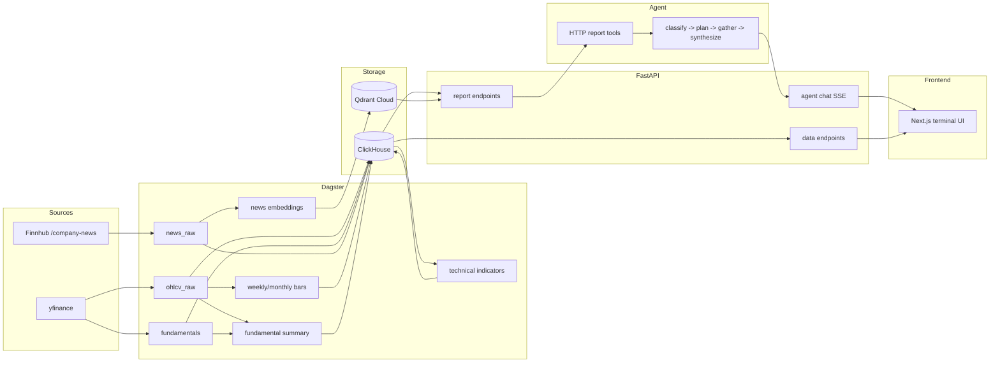

# Equity Data Agent

> Production-style AI/data engineering portfolio project for US equities. The
> agent can write an investment thesis, but it is not allowed to invent or
> calculate financial numbers: Dagster computes them, FastAPI prints them into
> report strings, and LangGraph reasons over those reports. A regression eval
> checks every numeric literal in the answer against the retrieved reports.

[](https://equity-data-agent-ynr2.vercel.app)


## Try It

Live app: **[equity-data-agent-ynr2.vercel.app](https://equity-data-agent-ynr2.vercel.app)**

Good demo prompts:

- `Give me a balanced thesis on NVDA`
- `Compare MSFT and GOOGL`
- `What's the news sentiment on TSLA?`

The current universe is 10 US equities: NVDA, AAPL, MSFT, GOOGL, AMZN, META,
TSLA, JPM, V, and UNH. Data ingests daily after market close.

## Why This Exists

LLMs are useful at synthesis, but unreliable at financial arithmetic. A model
that fabricates RSI, miscomputes YoY growth, or invents a P/E ratio can poison
an otherwise plausible thesis.

This project treats that as an architecture problem:

| Role | Layer | Responsibility |
|---|---|---|
| Worker | Dagster | Fetch data and compute indicators, ratios, aggregations, and embeddings |
| Interpreter | FastAPI | Query ClickHouse/Qdrant and format human-readable report strings |
| Executive | LangGraph | Read reports, choose a response shape, and synthesize the answer |

The agent has no database client, no calculator tool, and no access to raw
tables. It only sees the report text FastAPI gives it.

## What This Demonstrates

| Area | Proof |
|---|---|
| AI engineering | Intent-routed LangGraph agent, LiteLLM routing, structured outputs, SSE streaming, hallucination/provenance evals |
| Data engineering | Dagster asset graph, ClickHouse warehouse, Qdrant news embeddings, idempotent migrations, multi-timeframe aggregation |
| Product engineering | Next.js 16 app with watchlist, ticker detail, charting, fundamentals, news, and persistent chat panel |
| Production ops | Hetzner Docker Compose backend, Vercel frontend, Cloudflare named tunnel, health checks, alerts, runbooks |
| Engineering process | 19 ADRs, 7 phase retros, 700+ tests, security scanners, deploy gates, model bench history |

Badges and counts are supporting evidence, not the point:


## Hallucination Resistance

The precise guarantee is:

> The agent should not introduce numeric financial claims that are absent from
> the report strings it retrieved.

That is narrower, and more useful, than claiming the model can never be wrong.
The project separates two concerns:

| Layer | Guarantee |
|---|---|
| Provenance | Numeric claims must be copied from retrieved reports, not calculated by the LLM |
| Correctness | Evals and judge scores track whether the cited numbers answer the actual question |

Enforcement:

- **Architecture**: [ADR-003](docs/decisions/003-intelligence-vs-math.md) keeps arithmetic in Dagster and report templates, not the agent.
- **Prompt contract**: the system prompt requires every numeric claim to cite its report source.
- **Eval harness**: [`hallucination.py`](packages/agent/src/agent/evals/hallucination.py) extracts numeric literals from generated answers and checks them against tool-output reports.

Most recent 22-question bench:

| Model | hallucination_ok | tool_call_ok | judge | cos | avg latency | Role |
|---|---:|---:|---:|---:|---:|---|
| Llama-3.3-70B | 22/22 | 22/22 | 7.91 | 0.417 | 14.6s | Production default |
| Llama-4-Scout-17B | 22/22 | 22/22 | 7.14 | 0.411 | 3.8s | Fast fallback |
| GPT-OSS-120B | 21/22 | 22/22 | 5.14 | 0.438 | 21.7s | Disqualified |
| GPT-OSS-20B | 22/22 | 22/22 | 4.09 | 0.398 | 27.4s | Clean but weak |

Judge scores can be gamed by verbose answers; cosine similarity against reference responses is the harder-to-game cross-check.

The GPT-OSS-120B miss is the reason this eval exists: it passed the smaller
bench, then fabricated a number once the golden set expanded to cover more
news-sentiment questions.

## Architecture



Read the fuller system description in
[`docs/architecture/system-overview.md`](docs/architecture/system-overview.md).

## Screenshots

**Live terminal** - watchlist, ticker detail, charting, fundamentals, news, and
chat in one persistent workspace.


**CLI thesis** - the same agent can produce a structured thesis from the
terminal.


**Langfuse trace** - request-level trace with LangGraph spans, model metadata,
token usage, and eval scores.


**Dagster asset graph** - asset lineage from raw OHLCV to derived indicators.


## Stack

| Tier | Technology |
|---|---|
| Frontend | Next.js 16, React 19, Tailwind, TradingView Lightweight Charts, Vercel |
| API | FastAPI, SSE, Pydantic settings, SlowAPI rate limits, Sentry |
| Agent | LangGraph, LangChain, LiteLLM, Groq default, Gemini override, Langfuse |
| Data | Dagster, ClickHouse, Qdrant Cloud, yfinance, Finnhub |
| Infra | uv workspaces, Docker Compose, Hetzner CX41, Cloudflare named tunnel |
| Quality | pytest, Ruff, Pyright, npm lint/typecheck, pip-audit, bandit, gitleaks, Trivy |

## Production Notes

The backend runs on a Hetzner VPS with Docker Compose. The frontend runs on
Vercel. FastAPI is exposed through a Cloudflare named tunnel at a stable
`api.<domain>` hostname; port 8000 is not open to the public internet.

Production hardening includes:

- SOPS-encrypted secrets and deploy-time decryption.
- SHA and Dagster-load deploy gates.
- Idempotent ClickHouse migrations on deploy.
- Health checks for API, ClickHouse, Qdrant, and service identity.
- UptimeRobot, Sentry, Langfuse, Prometheus, Grafana, cAdvisor, node_exporter, and Dozzle.
- Discord alerts for Dagster failures, container events, and infrastructure alerts.
- Failure-mode runbook in [`docs/guides/ops-runbook.md`](docs/guides/ops-runbook.md).

The detailed tradeoffs live in [`docs/decisions/`](docs/decisions/), especially:

- [ADR-003: Intelligence vs. Math](docs/decisions/003-intelligence-vs-math.md)
- [ADR-007: Minimal Agent Graph First](docs/decisions/007-minimal-agent-graph-first.md)
- [ADR-011: LLM Routing](docs/decisions/011-llm-routing-groq-default-gemini-override.md)
- [ADR-017: Public Chat, No Auth](docs/decisions/017-public-chat-truly-public-no-auth.md)
- [ADR-018: Cloudflare Tunnel Ingress](docs/decisions/018-cloudflare-quick-tunnel-for-https-ingress.md)

## Quick Start

Prerequisites: Python 3.12+, [`uv`](https://docs.astral.sh/uv/), Docker, Node,
and API keys for the providers you want to use.

```bash
git clone https://github.com/noahwins-ng/equity-data-agent.git
cd equity-data-agent
make setup
$EDITOR .env

# terminals
make dev-litellm
make dev-api
make dev-dagster
make dev-frontend

# run a local thesis against available data
uv run python -m agent analyze NVDA
```

Useful checks:

```bash
make lint
make test
npm --prefix frontend run lint
npm --prefix frontend run typecheck
uv run python -m agent.evals
```

## Documentation

Start here:

- [`docs/INDEX.md`](docs/INDEX.md) - documentation map.
- [`docs/project-requirement.md`](docs/project-requirement.md) - current requirements and architecture spec.
- [`docs/architecture/system-overview.md`](docs/architecture/system-overview.md) - system boundaries and data flow.
- [`docs/decisions/`](docs/decisions/) - ADRs.
- [`docs/retros/`](docs/retros/) - phase retrospectives.
- [`docs/guides/ops-runbook.md`](docs/guides/ops-runbook.md) - production failure-mode catalog.
