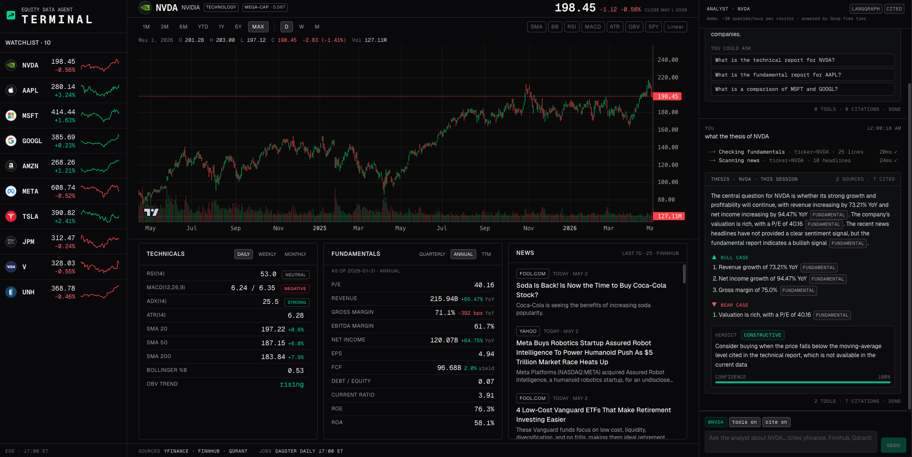
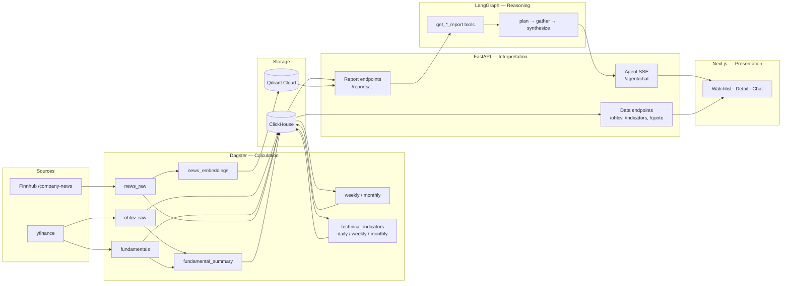
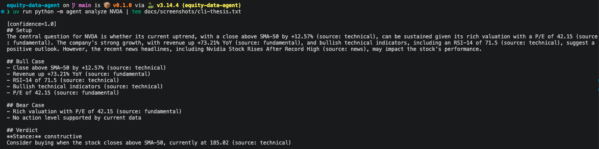
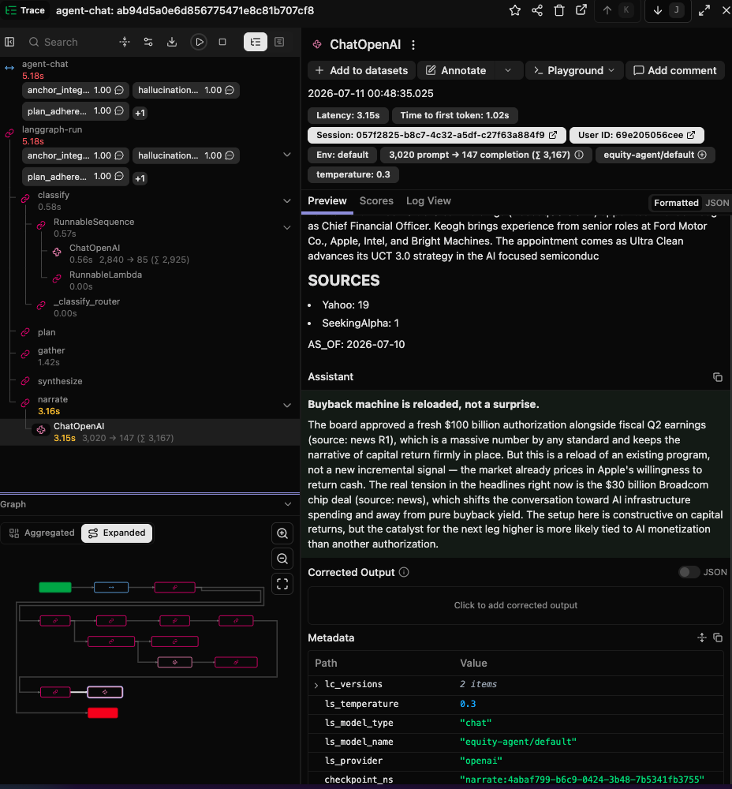

# Equity Data Agent

[](https://equity-data-agent-ynr2.vercel.app)



> An AI research system for US equities where **the LLM never does math.** Every number in every thesis is pre-computed by Dagster, served as a human-readable report by FastAPI, and only *interpreted* by the LangGraph agent. Hallucinated financials are architecturally impossible.


---

## What's shipped (May 2026)

- **Live frontend** at [equity-data-agent-ynr2.vercel.app](https://equity-data-agent-ynr2.vercel.app) — Next.js 16 + TradingView Lightweight Charts v5 + SSE chat panel
- **Public chat agent** — rate-limited (5/min, 30/hr, 100/day per IP), per-IP daily Groq-token budget, fail-closed circuit breaker (no paid-provider fallback)
- **10-ticker universe** — NVDA, AAPL, MSFT, GOOGL, AMZN, META, TSLA, JPM, V, UNH; daily Dagster ingest at 17:00 ET
- **8 Dagster assets, 17 asset checks, 2 schedules** in production (gated at every CD run)
- **16/16 hallucination_ok** on the QNT-67 golden set (Llama-4-Scout-17B via Groq free tier)

Phase 7 in flight: Sentry integration, real-SQL integration tests per router, Groq-TPD load test.

---

## Why this exists

Off-the-shelf LLMs hallucinate financial numbers — fabricated RSI values, invented YoY growth, miscomputed P/E ratios. One hallucinated number poisons the rest of the thesis.

**This project enforces a hard architectural boundary** ([ADR-003](docs/decisions/003-intelligence-vs-math.md)):

- **Dagster** computes 100% of the math (technical indicators, fundamental ratios, multi-timeframe aggregation, news embeddings) and writes idempotently to ClickHouse + Qdrant.
- **FastAPI** turns database rows into pre-formatted, human-readable report strings — `"RSI 72.3 — above the 70 overbought threshold, momentum extended"`.
- **LangGraph agent** receives those strings as tool output and reasons over them. It never sees a raw row, never connects to the database, and never performs arithmetic.

A regression suite regexes every numeric literal out of the agent's thesis and asserts it appears verbatim in one of the report strings the agent received. Mismatches fail CI — see [Hallucination resistance](#hallucination-resistance) below.

---

## Hallucination resistance

This is the product's main claim. The contract:

> **The agent's thesis cannot contain a number that was not pre-computed by Dagster and printed verbatim into a FastAPI report string.**

Three independent enforcement layers:

1. **Architecture** ([ADR-003](docs/decisions/003-intelligence-vs-math.md)) — the agent has no database client, no calculator tool, no arithmetic primitives. It physically cannot compute a number; the only numbers it sees are the ones FastAPI already chose to print.
2. **System prompt** — `SYSTEM_PROMPT` in [`packages/agent/src/agent/prompts/`](packages/agent/src/agent/prompts/) ratifies the rule: "every numeric claim must cite the report it came from; never derive a new number".
3. **Eval harness** — [`packages/agent/src/agent/evals/hallucination.py`](packages/agent/src/agent/evals/hallucination.py) regexes every numeric literal from a generated thesis and asserts each appears verbatim in one of the report strings the agent received as tool output. Run on a 16-question golden set covering all 10 portfolio tickers; results land in [`packages/agent/src/agent/evals/history.csv`](packages/agent/src/agent/evals/history.csv) so prompt-version quality is `git log -p`-visible.

Most recent cross-model bench ([`docs/model-bench-2026-04.md`](docs/model-bench-2026-04.md)): **Llama-4-Scout-17B → 16/16 hallucination_ok, 16/16 tool_call_ok on 16 complete theses** — promoted as the fallback. Llama-3.3-70B (the production default) lands 9/9 clean on the records that fit inside Groq's daily TPD bucket; the remaining 7 records were truncated mid-bench and are tracked for a clean re-run.

[ADR-012](docs/decisions/012-domain-conventions-in-reports-not-prompts.md) extends the contract: *canonical thresholds* (RSI 70/30, P/E rich/cheap bands) live in the **report templates**, never in the prompt — so the model can quote them without "leaking" prior knowledge.

---

## Architecture



Three roles, no overlap:

| Role | Layer | What it does | Where it lives |
|---|---|---|---|
| **Worker** | Dagster | Fetches and transforms data; owns 100% of arithmetic | `packages/dagster-pipelines/` |
| **Interpreter** | FastAPI | Turns DB rows into pre-formatted reports + chart-ready JSON | `packages/api/` |
| **Executive** | LangGraph | Reasons over reports, synthesizes a structured thesis | `packages/agent/` |

See [`docs/architecture/system-overview.md`](docs/architecture/system-overview.md) for the full data-flow + boundary documentation. Production topology is [ADR-010](docs/decisions/010-dagster-production-topology.md) (split code-server / daemon / webserver, `DockerRunLauncher` with per-run ephemeral containers).

---

## Screenshots

**Live terminal** — deployed at [equity-data-agent-ynr2.vercel.app](https://equity-data-agent-ynr2.vercel.app). Watchlist on the left, ticker detail (chart + technicals + fundamentals + news) center, agent chat panel right. Server-rendered with ISR; chat streams over SSE.


**CLI thesis** — `uv run python -m agent analyze NVDA` produces a structured Setup / Bull Case / Bear Case / Verdict report. Every number in the output is traceable back to a Dagster-computed report string.



**Langfuse trace** — a full `plan → gather → synthesize` agent run with tool-call latencies and per-step token usage.



**Dagster asset graph** — `ohlcv_raw → ohlcv_weekly / technical_indicators / fundamental_summary` lineage with run-status decorations.


Capture recipe + re-shoot cadence: [`docs/screenshots/README.md`](docs/screenshots/README.md).

---

## Stack

| Tier | Technology | Why |
|---|---|---|
| Storage | **ClickHouse** + **Qdrant Cloud** | Columnar OLAP for indicators / ratios; managed vector store for news embeddings ([ADR-001](docs/decisions/001-clickhouse-over-postgres.md), [ADR-009](docs/decisions/009-embedding-via-qdrant-cloud-inference.md)) |
| Orchestration | **Dagster** | Asset-based lineage, sensors trigger downstream recompute, asset checks with real domain bounds catch bugs that pass code review |
| API | **FastAPI** | Async, Pydantic-native, auto-generated OpenAPI; rate-limit + per-IP token budget + fail-closed breaker for the public chat endpoint ([ADR-017](docs/decisions/017-public-chat-truly-public-no-auth.md)) |
| Agent | **LangGraph** | 3-node minimal graph (plan / gather / synthesize) per [ADR-007](docs/decisions/007-minimal-agent-graph-first.md); 4-intent classifier (thesis / quick-fact / comparison / conversational) |
| LLM routing | **LiteLLM** + **Groq** (default) + **Gemini 2.5 Flash** (override) | One model alias `equity-agent/default`; switch backends via env var ([ADR-011](docs/decisions/011-llm-routing-groq-default-gemini-override.md)) |
| Observability | **Langfuse** (agent traces) + **Sentry** (FastAPI errors, hooks live) | |
| Frontend | **Next.js 16** on **Vercel** | [ADR-005](docs/decisions/005-nextjs-vercel-over-python-native-frontend.md), [ADR-008](docs/decisions/008-no-vercel-ai-sdk.md) (no Vercel AI SDK — native fetch + ReadableStream for SSE), [ADR-014](docs/decisions/014-nextjs-rendering-mode-per-page.md) (rendering mode per page) |
| Ingress | **Cloudflare quick tunnel** | Free HTTPS at `*.trycloudflare.com`, FastAPI port :8000 closed to public internet, no domain purchase ([ADR-018](docs/decisions/018-cloudflare-quick-tunnel-for-https-ingress.md)) |
| Packaging | **uv workspaces** | 4 packages under `packages/` ([ADR-002](docs/decisions/002-monorepo-uv-workspaces.md)) |

---

## Production ops

Deployment isn't `git push` and pray. Each merge to `main` runs a series of explicit gates designed by every prior outage:

1. **SOPS decrypt** — age-encrypted `.env.sops` decrypted in CI, never written to prod disk
2. **SHA gate** ([QNT-88](docs/retros/phase-3-api-layer.md)) — `git rev-parse HEAD` on prod must match the merged commit. Catches the "deploy succeeded but code is 17 commits behind" outage class.
3. **Dagster load gate** ([QNT-89](docs/retros/phase-3-api-layer.md)) — definitions module imports cleanly with `≥8 assets`, `≥17 checks`, `≥2 schedules`. Catches the silent "code-server up but graph broken" class.
4. **Health-check loop** — 60s timeout retries on `/health`; deploy fails if API doesn't come up.
5. **Idempotent ClickHouse migrations** ([QNT-146](docs/retros/phase-2-calculation-layer.md)) — re-applied every deploy.
6. **Bind-mount config detection** ([QNT-124](docs/retros/phase-3-api-layer.md)) — changes to `litellm_config.yaml` / `dagster.yaml` / `workspace.yaml` trigger explicit `docker compose restart` (catches stale-config-on-disk class).

Ingress topology ([ADR-018](docs/decisions/018-cloudflare-quick-tunnel-for-https-ingress.md)):

```
Browser → https://equity-data-agent-ynr2.vercel.app   (Vercel CDN, frontend)
        → https://*.trycloudflare.com                 (Cloudflare edge, free WAF + DDoS)
        → cloudflared (outbound from Hetzner — no public ingress port)
        → api:8000                                    (FastAPI, loopback-bound)
```

End-to-end HTTPS for $0 (no domain purchase, no Let's Encrypt). The `*.trycloudflare.com` hostname rotates on cloudflared restart; recovery runbook in [`docs/guides/vercel-deploy.md`](docs/guides/vercel-deploy.md) is ~5 min.

**Why not a PaaS** ([ADR-013](docs/decisions/013-stay-on-bespoke-compose-not-coolify.md)) — every PaaS default is now a documented decision in this repo: HEALTHCHECK + log rotation + `mem_limit`, `restart: unless-stopped`, `autoheal` for sick-but-still-up containers. Each one paid for in incident-debrief, not assumed.

The full failure-mode catalog (symptoms → diagnosis → response → prevention) lives in [`docs/guides/ops-runbook.md`](docs/guides/ops-runbook.md).

**Alerting** — UptimeRobot probe on `/api/v1/health` (Discord) + a `docker-events-notify` systemd unit streaming `die`/`kill`/`oom`/`restart` events to Discord ≤30s. Health monitor cron every 15 min surfaces failures via `make monitor-log`.

---

## Quick start

**Prerequisites**: macOS or Linux, Python 3.12+, [`uv`](https://docs.astral.sh/uv/), Docker, an SSH key on the Hetzner host (or your own ClickHouse), free-tier API keys for [Groq](https://console.groq.com), [Google AI Studio](https://aistudio.google.com/apikey), and (optional) [Qdrant Cloud](https://cloud.qdrant.io) + [Langfuse](https://us.cloud.langfuse.com).

```bash
git clone https://github.com/noahwins-ng/equity-data-agent.git
cd equity-data-agent
make setup                          # installs git hooks, syncs uv workspaces, copies .env.example → .env
$EDITOR .env                        # paste GROQ_API_KEY, GEMINI_API_KEY, CLICKHOUSE_*, etc.
make tunnel                         # SSH tunnel to Hetzner ClickHouse on :8123 (terminal 1)
make migrate                        # apply ClickHouse DDL — only needed on a fresh DB
make dev-litellm                    # LiteLLM proxy on :4000  (terminal 2)
make dev-api                        # FastAPI on :8000        (terminal 3)
make dev-dagster                    # Dagster UI on :3000     (terminal 4, optional)

# now you can run the agent against live data
uv run python -m agent analyze NVDA
```

`make help` lists every target with a one-line description.

---

## Development workflow

The repo is built around a tight inner loop: every issue gets its own branch, its own PR, and squash-merges to `main`. Slash-command shortcuts (Claude Code) glue Linear status, branch state, and CI together so context-switching is cheap.

| Surface | Command | URL |
|---|---|---|
| Dagster UI (asset graph, schedules, sensors) | `make dev-dagster` | http://localhost:3000 |
| FastAPI (auto-generated OpenAPI docs) | `make dev-api` | http://localhost:8000/docs |
| LiteLLM proxy (model routing) | `make dev-litellm` | http://localhost:4000 |
| Next.js frontend | `make dev-frontend` | http://localhost:3001 |
| ClickHouse Play (SQL editor) | `make tunnel` | http://localhost:8123/play |

```bash
# day-to-day
make lint                           # ruff check + pyright
make format                         # ruff format
make test                           # pytest (unit, no infra)
make test-integration               # pytest (needs: make tunnel)

# eval harness — runs the 16-question golden set against any LiteLLM-routed model
uv run python -m agent.evals
uv run python -m agent.evals --model equity-agent/bench-llama4scout

# issue-driven flow (one branch / one PR per ticket)
make issue QNT=66                   # checkout branch + flip Linear to In Progress
make pr    QNT=66 TITLE="..."       # push + open PR with `Closes QNT-XX` so Linear auto-closes
```

Slash commands (`/pick`, `/implement`, `/sanity-check`, `/review`, `/ship`, `/go`) drive the issue → PR → merge → deploy pipeline; `/server-audit` and `/retro` cover the ops + end-of-phase rituals. Full reference: [`docs/guides/dev-workflow.md`](docs/guides/dev-workflow.md). Project conventions (commit format, branching, MCP server setup, hooks) live in [`CLAUDE.md`](CLAUDE.md).

---

## Documentation

The repo's "shared brain" is under [`docs/`](docs/INDEX.md):

- [`docs/INDEX.md`](docs/INDEX.md) — entry point
- [`docs/architecture/system-overview.md`](docs/architecture/system-overview.md) — how the system works (data flow, package boundaries, prod infra)
- [`docs/decisions/`](docs/decisions/) — **18 ADRs** documenting every non-obvious choice (storage, orchestration, agent shape, LLM routing, deploy ingress)
- [`docs/retros/`](docs/retros/) — phase retrospectives ([Phase 0](docs/retros/phase-0-foundation.md) · [Phase 1](docs/retros/phase-1-data-ingestion.md) · [Phase 2](docs/retros/phase-2-calculation-layer.md) · [Phase 3](docs/retros/phase-3-api-layer.md) · [Phase 4](docs/retros/phase-4-narrative-data.md) · [Phase 5](docs/retros/phase-5-agent-layer.md) · [Phase 6](docs/retros/phase-6-frontend.md))
- [`docs/patterns.md`](docs/patterns.md) — established code recipes
- [`docs/guides/ops-runbook.md`](docs/guides/ops-runbook.md) — failure-mode catalog (symptoms → diagnosis → response → prevention)
- [`docs/guides/vercel-deploy.md`](docs/guides/vercel-deploy.md) — Phase 6 deploy + rotation runbook
