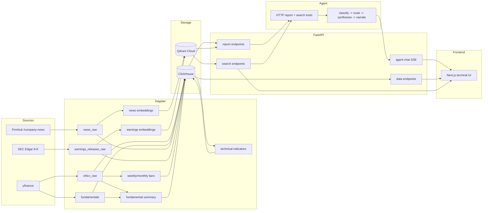
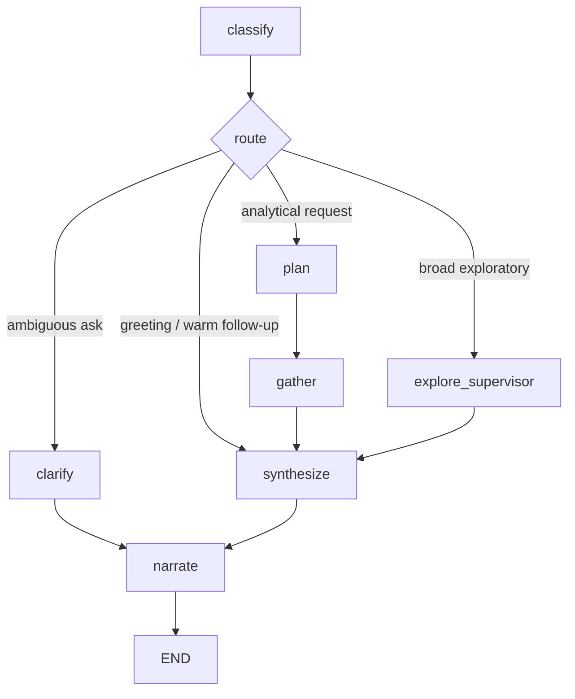
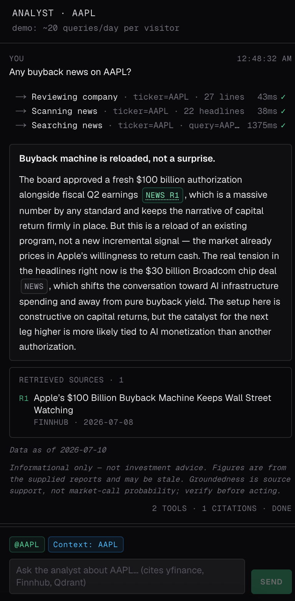
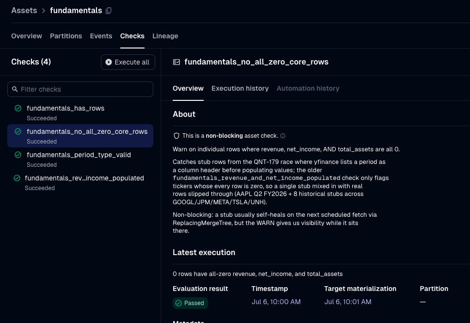

# Equity Data Agent

> Production-deployed AI/data engineering project for US equities. The agent writes
> an investment thesis but is **not allowed to invent or calculate numbers** —
> Dagster computes them, FastAPI prints them into report strings, and LangGraph
> reasons over those reports. An eval checks every number in the answer against
> the retrieved reports.

[](https://equity-data-agent-ynr2.vercel.app)


## Highlights

A 30-second scan across both disciplines. The lead is AI engineering — the grounded, eval-guarded agent — resting on a data platform built to make that grounding guarantee possible. Every cell is backed by a section below.

| Data engineering | AI engineering |
|---|---|
| Medallion ClickHouse warehouse (`equity_raw` -> `equity_derived`), 28 idempotent migrations, `ReplacingMergeTree` + `FINAL`/`argMax` reads | LangGraph agent: 9 response shapes, a router with a deterministic clarify step, multi-turn continuity via a checkpointer |
| Dagster asset graph: 17 indicator columns across three timeframes, 20+ fundamental ratios, two RAG embedding corpora (news + SEC 8-K) | Grounded RAG over news + SEC-8K corpora: hybrid dense+BM25, Cohere reranking, targeted-event routing, streamed provenance |
| 37 domain-bounded asset checks (dbt-test equivalent) **plus Pandera source contracts** routing bad rows to an auditable reject sink | Layered evals: numeric grounding, golden regression, tool-call, dialogue, IR retrieval metrics (recall@k / MRR / nDCG), LLM-judged RAGAS/G-Eval |
| Data observability: per-ticker freshness, volume/distribution + anomaly checks on a Grafana dashboard, Dagster asset graph as lineage | LiteLLM provider routing + fallback chain + per-node model tiering; every request a Langfuse trace with a prompt-version hash |

## Try It

Live app: **[equity-data-agent-ynr2.vercel.app](https://equity-data-agent-ynr2.vercel.app)** — try `Give me a balanced thesis on NVDA`, `Compare MSFT and GOOGL`, or `What's the news sentiment on TSLA?`

The universe is 10 semis/tech-concentrated US equities (NVDA, AAPL, MSFT, GOOGL, AMZN, META, TSLA, MU, AMD, INTC) — a scope choice that keeps every ticker in sectors the agent can reason about with shared context (AI/data-center demand, the semi cycle). Data ingests daily after market close.

## Why This Exists

LLMs synthesize well but are unreliable at arithmetic — a fabricated RSI or an invented P/E poisons an otherwise plausible thesis. This project treats that as an architecture problem:

| Role | Layer | Responsibility |
|---|---|---|
| Worker | Dagster | Fetch data; compute indicators, ratios, aggregations, embeddings |
| Interpreter | FastAPI | Query ClickHouse/Qdrant, format human-readable report strings |
| Executive | LangGraph | Read reports, choose a response shape, synthesize the answer |

The agent has no database client, no calculator tool, and no access to raw tables. It only sees the report text FastAPI gives it.

## What This Demonstrates

Beyond the two pillars above:

| Area | Proof |
|---|---|
| Product engineering | Next.js 16 app: watchlist, ticker detail, charting, fundamentals, news, persistent SSE chat panel |
| Production ops | Hetzner Docker Compose + Vercel + Cloudflare tunnel; deploy gates with auto-rollback, autoheal, alerts, runbooks |
| Engineering process | 27 ADRs, 7 phase retros, 1,700+ tests, security scanners, model-bench history |


## Architecture



The agentic boundary is the load-bearing constraint: the agent only calls HTTP tools that return report text — no database client, no raw tables, no calculator. Fuller description in [`docs/architecture/system-overview.md`](docs/architecture/system-overview.md).

## AI Engineering

The agent is a controllable graph, not a single prompt — routing, retrieval, and evaluation are each first-class.



- **Intent routing.** `classify` sorts each question into 9 response shapes; the router sends ambiguous asks (missing ticker, no prior turn) to a deterministic clarify step, greetings straight to synthesis, and broad exploratory asks to a zero-LLM exploration supervisor.
- **Grounded RAG.** Two Qdrant corpora (news + SEC 8-K). Query-time hybrid retrieval (dense MiniLM + BM25, RRF-fused) with optional Cohere rerank; a keyword gate fires RAG only for targeted events (litigation, buybacks, M&A, …), and retrieved sources stream to the UI as provenance.
- **Provider routing & tracing.** LiteLLM behind one alias: one-line model swap, automatic fallback chain (paid `deepseek-v4-flash` -> free `nemotron-3-ultra` anchor -> deterministic degrade), and per-node tiering (a small model runs classify/plan). Every request is a Langfuse trace with a prompt-version hash.
- **Multi-turn continuity.** A checkpointer carries a compact transcript with per-intent history budgets, so follow-ups reuse prior reports without re-fetching.

### Evaluation & hallucination resistance

The guarantee is deliberately narrow:

> The agent must not introduce numeric claims absent from the reports it retrieved.

Two concerns, kept separate: **provenance** (numbers are copied from reports, not computed by the LLM) and **correctness** (evals + an LLM judge check the cited numbers actually answer the question). Enforcement is layered — architecture ([ADR-003](docs/decisions/003-intelligence-vs-math.md)) keeps arithmetic out of the agent, the prompt requires every number to cite its report, and a CI eval suite guards it:

- numeric grounding ([`hallucination.py`](packages/agent/src/agent/evals/hallucination.py)) — every numeric literal traced to a report;
- golden-set regression ([`golden_set.py`](packages/agent/src/agent/evals/golden_set.py)) — 44 questions across all 10 tickers;
- tool-call ([`tool_calls.py`](packages/agent/src/agent/evals/tool_calls.py)) and dialogue ([`dialogue_eval.py`](packages/agent/src/agent/evals/dialogue_eval.py), a 5-axis LLM judge);
- retrieval IR metrics ([`retrieval_eval.py`](packages/agent/src/agent/evals/retrieval_eval.py): recall@k / MRR / nDCG);
- LLM-judged RAGAS + G-Eval ([`deepeval_eval.py`](packages/agent/src/agent/evals/deepeval_eval.py), off the hot path) and RAG routing ([`news_search_eval.py`](packages/agent/src/agent/evals/news_search_eval.py)).

**Results** — latest clean-window run on the current primary (`deepseek-v4-flash` via OpenRouter, [ADR-025](docs/decisions/025-paid-launch-primary-and-breaker-recalibration.md)); full history in [`docs/model-bench-2026-04.md`](docs/model-bench-2026-04.md):

| Suite | Latest | Per-PR CI gate |
|---|---|---|
| Golden regression (2026-07-04) — tool-call / grounding / answer-cosine | 40/41 · 40/41 · 0.43 | dev harness (directional) |
| Retrieval (hybrid + Cohere rerank) — recall@5 / recall@20 | 0.53 / 0.76 | blocking (floors 0.45 / 0.68) |
| Retrieval — MRR / nDCG@10 | 0.94 / 0.79 | blocking (floors 0.85 / 0.70) |
| Number grounding (frozen artifacts) | pass | blocking — red on any unsupported numeric |
| Grounding ablation (2026-07-11) — fabricated-number rate, grounding on → off | 0.0% → 86.9% | illustrative (not gated) |

**What grounding buys.** Strip report-grounding from the *same* model over the same 44-question set — no report injection, no cite-every-number rule — and it invents **299 of 344** figures (86.9%) against reports it never saw, versus the constrained agent's **0 of 619** (0.0%): only 1 of 44 unconstrained answers is fully clean, against all 44 constrained. The intelligence-vs-math split isn't decoration — it's the gap between 0 and 87% invented numbers. Reproduce: `uv run python -m agent.evals.baseline_eval` ([`baseline_eval.py`](packages/agent/src/agent/evals/baseline_eval.py)).

Economics: ~`$0.002` per thesis on the paid DeepSeek primary ([ADR-026](docs/decisions/026-paid-synthesis-economics-and-free-tier-simplification-dividend.md)); the earlier "near-zero free-tier" framing is retired. Golden flags seen in earlier runs were scorer false positives on glued magnitude units (e.g. `$2.5T`) — fixed by sharpening the scorer, not loosening the contract ([#411](https://github.com/noahwins-ng/equity-data-agent/pull/411)). The suite earns its keep by disqualifying production-candidate models (Qwen3-32B fabrications and leaked `<think>` blocks; GPT-OSS-120B once the golden set grew).

### Where this breaks at scale

- **Bench breadth** — one prompt revision × 44 questions is directional, not a leaderboard.
- **Fallback on free tiers** — the primary is paid (DeepSeek), but the Nemotron fallback anchor and the Groq small-tier still inherit RPD/TPD caps; sustained load leans further into paid inference or self-hosting.
- **Retrieval depth** — reranking is query-time only, and one MiniLM-384 embedder serves both corpora.
- **No fine-tuning** — behaviour is prompt- and routing-shaped.

## Data Engineering

Standard data-engineering patterns under Dagster-native names:

- **Tests on the data (dbt-test equivalent).** 37 domain-bounded [asset checks](packages/dagster-pipelines/src/dagster_pipelines/asset_checks) assert real financial bounds (not just non-null) plus z-score volume/price anomaly detection. They earn their keep: the `pe_in_band` check caught two P/E formula bugs that both passed human review — a near-zero-EPS blowup to P/E 28,545, and a quarterly ratio dividing full market cap by single-quarter income instead of TTM. Declining dbt at this scale was deliberate ([ADR-022](docs/decisions/022-decline-dbt-adoption-at-current-scale.md)).
- **Source-boundary contracts.** Each ingestion source has a [Pandera schema](packages/shared/src/shared/contracts.py) validated before any DB write — schema drift hard-fails the partition; out-of-range cells route to the reject sink while clean rows proceed. Evolving a contract is a diff-visible commit, same discipline as a migration.
- **Medallion layering.** `equity_raw` (OHLCV, fundamentals, news, SEC 8-K) → `equity_derived` (multi-timeframe bars, 17 indicator columns, 20+ ratios). Every derived table rebuilds from raw, so only the raw layer must be durable.
- **Data observability.** Per-ticker freshness/staleness checks, volume/distribution trends on a [Grafana data-health dashboard](observability/grafana/dashboards/data-health.json), and the Dagster asset graph as lineage. Dropped rows land in `equity_raw.ingest_rejects` (reason, payload, 90-day TTL) — auditable, not silent.
- **Idempotency.** All tables `ReplacingMergeTree` with `FINAL`/`argMax` reads and re-runnable migrations; a daily incremental OHLCV pull plus a monthly full 2-year re-fetch heals split/dividend splices through the same dedup path.

### Where this breaks at scale

- **Partition cardinality** — `PARTITION BY ticker` is ideal at 10-15 values but degrades past ~100; a larger universe would switch to `toYYYYMM(date)`.
- **Market-data vendor** — yfinance carries no SLA; production means a paid feed (Polygon, databento).
- **Incremental / streaming** — transforms full-rebuild today; higher volume or intraday data would need incremental models and a streaming path.
- **Single-node ClickHouse** — one node serves this comfortably; growth means a sharded cluster.

## Screenshots

**Live terminal** — watchlist, ticker detail, charting, fundamentals, news, and chat in one persistent workspace.


**Grounded RAG provenance** — a targeted-event answer streaming with its retrieved-source citations in the chat panel.




**Langfuse trace** — request-level trace with LangGraph spans, model metadata, token usage, and eval scores.


**Dagster asset graph** — asset lineage from raw OHLCV to derived indicators.


**Dagster asset checks** — domain-bounded data tests (RSI 0-100, P/E band, MACD coherence) with pass/fail status.



## Stack

| Tier | Technology |
|---|---|
| Frontend | Next.js 16, React 19, Tailwind, TradingView Lightweight Charts, Vercel |
| API | FastAPI, SSE, Pydantic settings, SlowAPI rate limits, Sentry |
| Agent | LangGraph, LangChain, LiteLLM, paid DeepSeek primary, Groq small-tier, Nemotron fallback, Cohere rerank, Langfuse |
| Data | Dagster, ClickHouse, Qdrant Cloud, Pandera, yfinance, Finnhub, SEC Edgar |
| Eval | pytest harness, ir-measures, DeepEval (RAGAS + G-Eval), LLM-as-judge |
| Infra | uv workspaces, Docker Compose, Hetzner CX41, Cloudflare named tunnel |
| Quality | Ruff, Pyright, npm lint/typecheck, pip-audit, bandit, gitleaks, Trivy |

## Production Notes

Backend on a Hetzner VPS (Docker Compose); frontend on Vercel. FastAPI is reached through a Cloudflare named tunnel at a stable `api.<domain>` hostname — port 8000 is not public.

- **Deploy gates** — SHA, Dagster-load, and observability-smoke checks, with auto-rollback to the previous SHA on smoke failure; idempotent ClickHouse migrations on every deploy.
- **Self-healing** — health checks (API, ClickHouse, Qdrant, service identity) + an autoheal container that restarts services that go unhealthy without exiting.
- **Observability & alerts** — UptimeRobot, Sentry, Langfuse, Prometheus/Grafana, cAdvisor, node_exporter, Dozzle; Discord alerts for Dagster failures, container events, and infra. Failure-mode [runbook](docs/guides/ops-runbook.md).
- **Secrets** — SOPS-encrypted, decrypted at deploy time.

Key tradeoffs: [ADR-003 Intelligence vs. Math](docs/decisions/003-intelligence-vs-math.md) · [ADR-025 Paid Inference Primary](docs/decisions/025-paid-launch-primary-and-breaker-recalibration.md) · [ADR-017 Public Chat, No Auth](docs/decisions/017-public-chat-truly-public-no-auth.md) · [ADR-018 Cloudflare Tunnel](docs/decisions/018-cloudflare-quick-tunnel-for-https-ingress.md).

## Quick Start

Prerequisites: Python 3.12+, [`uv`](https://docs.astral.sh/uv/), Docker, Node.

Minimum keys to run a thesis: an `OPENROUTER_API_KEY` (the DeepSeek primary) is the only required LLM key; RAG news search additionally needs a Qdrant Cloud URL/key and a Cohere key. The warehouse is reachable two ways — tunnel to a running ClickHouse, or start a throwaway local one (the `.env.example` default assumes the maintainer's SSH tunnel, so a fresh clone should take the local path):

```bash
docker run -d -p 8123:8123 clickhouse/clickhouse-server:24-alpine
make migrate && make seed   # DDL + a fast 30-day x 3-ticker seed
```

```bash
git clone https://github.com/noahwins-ng/equity-data-agent.git
cd equity-data-agent
make setup && $EDITOR .env

# terminals
make dev-litellm
make dev-api
make dev-dagster
make dev-frontend

# run a local thesis against available data
uv run python -m agent analyze NVDA
```

Checks: `make lint` · `make test` · `npm --prefix frontend run lint` · `uv run python -m agent.evals`

## Where to Look in the Code

Straight to the load-bearing work:

| What | Where |
|---|---|
| Agent graph (classify -> route -> synthesize -> narrate) | [`packages/agent/src/agent/graph.py`](packages/agent/src/agent/graph.py) |
| Intent router + deterministic clarify gate | [`packages/agent/src/agent/intent.py`](packages/agent/src/agent/intent.py) |
| Number-grounding / hallucination scorer | [`packages/agent/src/agent/evals/hallucination.py`](packages/agent/src/agent/evals/hallucination.py) |
| Retrieval pipeline (hybrid dense+BM25 RRF, rerank) | [`packages/shared/src/shared/retrieval.py`](packages/shared/src/shared/retrieval.py) |
| Data asset checks (dbt-test equivalent) | [`packages/dagster-pipelines/.../asset_checks/`](packages/dagster-pipelines/src/dagster_pipelines/asset_checks) |
| Pandera source contracts | [`packages/shared/src/shared/contracts.py`](packages/shared/src/shared/contracts.py) |

## Documentation

- [`docs/INDEX.md`](docs/INDEX.md) — documentation map.
- [`docs/project-requirement.md`](docs/project-requirement.md) — current requirements and architecture spec.
- [`docs/architecture/system-overview.md`](docs/architecture/system-overview.md) — system boundaries and data flow.
- [`docs/decisions/`](docs/decisions/) — ADRs · [`docs/retros/`](docs/retros/) — phase retrospectives · [`docs/guides/ops-runbook.md`](docs/guides/ops-runbook.md) — failure-mode catalog.

---

Built by Noah Ng. Licensed under [MIT](LICENSE).
