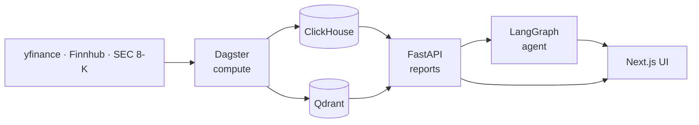

# Equity Data Agent

An AI analyst for 10 US tech equities that writes investment theses **without being allowed to invent or calculate a single number**. The data pipeline does all the math; the LLM only reasons over pre-computed reports, and an eval checks every number it outputs.

[](https://terminal.noahng.dev)


## The Idea

LLMs write well but are unreliable at arithmetic: one invented P/E ruins an otherwise plausible thesis. So the system is split into three roles that never overlap:

| Role | Layer | Does |
|---|---|---|
| Worker | Dagster | Fetches data, computes every indicator, ratio, and embedding |
| Interpreter | FastAPI | Turns database rows into plain-text reports |
| Executive | LangGraph | Reads the reports and writes the answer |

The agent has no database access and no calculator. It only sees report text.

**Does it matter?** Running the same model on the same 44 questions without the reports, it invents **87% of its numbers**. With them: **0%** (0 of 619). Reproduce with `uv run python -m agent.evals.baseline_eval`.

## Architecture


```mermaid
graph LR
    SRC[yfinance · Finnhub · SEC 8-K] --> DG[Dagster<br/>compute]
    DG --> CH[(ClickHouse)]
    DG --> QD[(Qdrant)]
    CH --> API[FastAPI<br/>reports]
    QD --> API
    API --> AG[LangGraph<br/>agent]
    AG --> UI[Next.js UI]
    API --> UI
```

Full data flow: [`docs/architecture/system-overview.md`](docs/architecture/system-overview.md).

## What's Inside

**AI engineering**
- **Routed agent graph.** Questions are classified into 9 answer types (thesis, comparison, quick fact, ...); ambiguous ones get a clarifying question instead of a guess.
- **RAG over news + SEC filings.** Hybrid search (vector + keyword) with reranking, triggered only for event questions (lawsuits, buybacks, M&A); sources are shown in the UI.
- **Evals in CI.** Every number traced back to a report, a 44-question regression set, retrieval quality metrics, and LLM-judged answer quality.
- **Model routing + tracing.** LiteLLM with automatic fallback between providers; every request traced in Langfuse. About $0.002 per thesis.

**Data engineering**
- **Layered warehouse.** Raw tables feed derived tables (17 technical indicators, 20+ fundamental ratios); everything derived can be rebuilt from raw.
- **Tests on the data.** 38 asset checks with real financial bounds, not just "not null". They caught two P/E formula bugs that passed code review, including a P/E of 28,545.
- **Input contracts.** Each source is schema-validated before writing; bad rows go to an auditable reject table instead of disappearing.
- **Idempotent by design.** Every table and migration is safe to re-run.

**Production**
- Hetzner (Docker Compose) backend + Vercel frontend, behind a Cloudflare tunnel.
- Deploys verify the running commit and auto-rollback on failure; unhealthy services restart themselves.
- Monitoring with Sentry, Grafana, Langfuse and Discord alerts, plus a [failure runbook](docs/guides/ops-runbook.md).

## Results

| Check | Result |
|---|---|
| Invented numbers (grounded vs. ungrounded) | 0% vs. 87% |
| Golden-set regression (correct tools / grounded answer) | 40 of 41 |
| Retrieval: right source ranked first (MRR) | 0.94 |

Full benchmark history: [`docs/model-bench-2026-04.md`](docs/model-bench-2026-04.md).

## Known Limits

- **Small universe.** 10 tickers; past ~100 the warehouse partitioning would need to change.
- **Free data source.** yfinance has no SLA; real use needs a paid feed.
- **Batch only.** Transforms rebuild daily; intraday data would need incremental and streaming paths.
- **Small benchmark.** 44 questions is a directional signal, not a leaderboard.
- **No fine-tuning.** Behaviour comes from prompts and routing.

## Try It

At **[terminal.noahng.dev](https://terminal.noahng.dev)**, ask things like:

- `Give me a balanced thesis on NVDA`
- `Compare MSFT and GOOGL`
- `Is MU overbought?`
- `Anything on the INTC lawsuit?`
- `What looks interesting right now?`

Tickers: NVDA, AAPL, MSFT, GOOGL, AMZN, META, TSLA, MU, AMD, INTC. Data updates daily after market close.

## Run Locally

Needs Python 3.12+, [`uv`](https://docs.astral.sh/uv/), Docker, Node, and an `OPENROUTER_API_KEY` (news search also needs Qdrant Cloud and Cohere keys).

```bash
git clone https://github.com/noahwins-ng/equity-data-agent.git
cd equity-data-agent
make setup && $EDITOR .env

# local ClickHouse + sample data (30 days, 3 tickers)
docker run -d -p 8123:8123 clickhouse/clickhouse-server:24-alpine
make migrate && make seed

# one terminal each
make dev-litellm
make dev-api
make dev-dagster
make dev-frontend

uv run python -m agent analyze NVDA
```

Checks: `make lint` · `make test` · `uv run python -m agent.evals`

## Where to Look in the Code

| What | Where |
|---|---|
| Agent graph | [`packages/agent/src/agent/graph.py`](packages/agent/src/agent/graph.py) |
| Intent router + clarify step | [`packages/agent/src/agent/intent.py`](packages/agent/src/agent/intent.py) |
| Number-grounding check | [`packages/agent/src/agent/evals/hallucination.py`](packages/agent/src/agent/evals/hallucination.py) |
| Retrieval (hybrid search + rerank) | [`packages/shared/src/shared/retrieval.py`](packages/shared/src/shared/retrieval.py) |
| Data asset checks | [`packages/dagster-pipelines/.../asset_checks/`](packages/dagster-pipelines/src/dagster_pipelines/asset_checks) |
| Source contracts | [`packages/shared/src/shared/contracts.py`](packages/shared/src/shared/contracts.py) |

## Screenshots

| RAG answer with sources | Langfuse trace |
|---|---|
|  |  |
| **Dagster lineage** | **Data checks** |
|  |  |

## Stack

Next.js · FastAPI · LangGraph · LiteLLM · Dagster · ClickHouse · Qdrant · Langfuse · Docker Compose · Hetzner · Vercel

## Docs

- [`docs/INDEX.md`](docs/INDEX.md): map of all docs
- [`docs/decisions/`](docs/decisions/): why X over Y (start with [ADR-003](docs/decisions/003-intelligence-vs-math.md))
- [`docs/retros/`](docs/retros/): phase retrospectives

---

Built by Noah Ng. [MIT](LICENSE).
