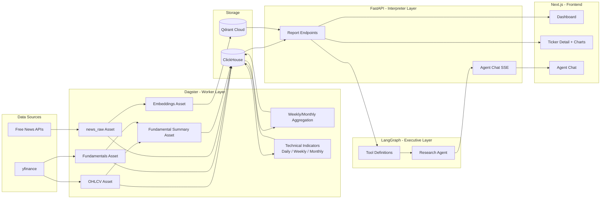
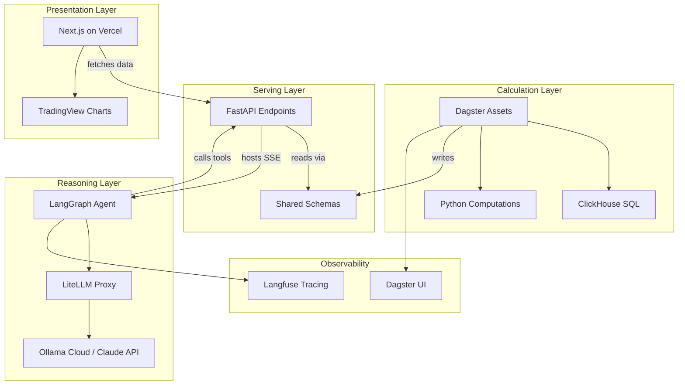

# Equity Data Agent — Project Requirements

## 1. Executive Summary

**Equity Data Agent** is an autonomous, institutional-grade equity research platform that transforms raw market data (price, fundamentals) and narrative data (news) into actionable investment theses.

This is a portfolio project demonstrating both **Data Engineering** and **AI Engineering** — from ingestion pipelines and columnar storage to agentic reasoning and vector search.

### The "Intelligence vs. Math" Philosophy

Most AI agents fail at financial analysis because they attempt to calculate technical indicators or financial ratios "in their heads," leading to hallucinations. This project enforces a hard separation:

| Layer | Responsibility | Technology |
|---|---|---|
| **Calculation Layer** | 100% of the math — indicators, ratios, aggregations | Python / SQL |
| **Reasoning Layer** | Interprets pre-computed results, formulates thesis | LLM (via LangGraph) |

The LLM never touches arithmetic. It receives fully computed, human-readable reports and reasons over them.

---

## 2. Architectural Principles

These rules are **non-negotiable**. Every design decision must satisfy all six.

### 2.1 Mathematical Isolation
The LLM is strictly forbidden from performing arithmetic — no RSI calculations, no percentage changes, no YoY growth. All **complex financial math** (indicators, ratios, aggregations) is performed by Dagster assets (Python/SQL) and passed to the agent as pre-formatted report strings.

FastAPI's Interpreter role may perform **trivial presentation-layer arithmetic** — e.g., daily change % from two close prices, RSI category thresholds, trend labels from SMA crossover. These are formatting decisions, not financial calculations.

### 2.2 Database Isolation
The Agent never connects directly to ClickHouse or Qdrant. It interacts solely with FastAPI endpoints. If the agent needs data, it calls a tool that hits an API.

### 2.3 Role Distinction

| Component | Role | Analogy |
|---|---|---|
| **Dagster** | The Worker | Always-on, fetches and transforms data on schedule |
| **FastAPI** | The Interpreter | Turns raw DB rows into readable, contextualized reports |
| **LangGraph** | The Executive | Reasons over reports, synthesizes investment theses |

### 2.4 Idempotency
All Dagster assets must be re-runnable. If the same data is fetched twice, ClickHouse handles de-duplication automatically via `ReplacingMergeTree` keyed on the `ORDER BY` columns.

### 2.5 Asset-Based Lineage
Data is defined as Software-Defined Assets in Dagster, not just cron jobs. The full lineage — Raw Price → Technical Indicator → Fundamental Summary → Agent Response — must be visible in the Dagster UI.

### 2.6 Ticker Scope
Initial scope is **10 high-conviction US equities**. The architecture must support scaling to hundreds of tickers without a rewrite. This means: no hardcoded ticker lists in business logic, partition-aware assets, and parameterized queries.

---

## 3. System Architecture

### 3.1 High-Level Data Flow



### 3.2 Component Responsibilities



### 3.3 Request Flow Example

When the agent needs to assess NVDA:

1. **Agent** calls `get_technical_report(ticker="NVDA")` tool
2. **Tool** makes HTTP request to `GET /api/v1/reports/technical/NVDA`
3. **FastAPI** queries ClickHouse for pre-computed indicators
4. **FastAPI** formats results into a human-readable string report
5. **Agent** receives the report string and reasons over it — zero math involved

---

## 4. Technical Stack

| Technology | Purpose | Rationale |
|---|---|---|
| **Python 3.12+** | Language | Ecosystem depth for data + ML |
| **uv** | Package management | Fast, deterministic, workspace support |
| **Dagster** | Orchestration | Asset-based lineage, built-in UI, sensor/schedule primitives |
| **FastAPI** | API layer | Async, Pydantic-native, auto-generated OpenAPI docs |
| **LangGraph** | Agent framework | Stateful graphs, tool integration, controllable execution flow |
| **ClickHouse** | Structured storage | Columnar, blazing fast aggregations, `ReplacingMergeTree` for idempotency |
| **Qdrant Cloud** | Vector storage | Managed free tier, native Python SDK, filtering support |
| **LiteLLM Proxy** | LLM routing | Switch between Ollama Cloud and Claude API without code changes. **Pin version in pyproject.toml** (supply chain incident March 2026 — do not float) |
| **Ollama Cloud** | Managed inference | Hosted Ollama API at `https://ollama.com/v1` (OpenAI-compatible). Eliminates local GPU/CPU requirement on Hetzner — no Ollama container in prod, saving 6GB RAM. |
| **Langfuse** | Observability | Trace agent thoughts, tool calls, and latency |
| **Next.js 15** | Frontend | App Router, SSR/SSG, React 19, Turbopack stable, Vercel-native deployment |
| **TradingView Lightweight Charts v5** | Financial charting | Free (Apache 2.0), candlestick, volume, indicator overlays, native multi-pane support |
| **Tailwind CSS** | Styling | Utility-first, fast iteration, consistent design |
| **Vercel** | Frontend hosting | Zero-config Next.js deployment, global CDN, preview deploys |
| **yfinance** | Market data | Free, covers US equities (price + fundamentals) |
| **Docker Compose** | Backend deployment | Single-command prod deployment with profile support |
| **GitHub Actions** | CI/CD | Automated testing and deployment pipeline |

### Resource Constraints (Hetzner CX41 — 16GB RAM)

| Service | Max Memory | Notes |
|---|---|---|
| ClickHouse | 4 GB | `max_memory_usage` setting |
| Dagster + FastAPI + Caddy + LiteLLM + OS | 12 GB | Inference via Ollama Cloud — no local model container. LiteLLM proxy ~300MB. 6GB freed vs self-hosted Ollama. |

---

## 5. Repository Structure

Monorepo using **uv workspaces** with four Python packages + one Next.js frontend:

```
equity-data-agent/
├── pyproject.toml                  # Root workspace definition
├── uv.lock
├── Dockerfile                      # Multi-stage build: `base` (uv + deps) → `dagster` target → `api` target
├── Caddyfile                       # Caddy reverse proxy config (prod HTTPS termination)
├── litellm_config.yaml             # LiteLLM model routing: dev/prod → Ollama Cloud; override → Claude API
├── docker-compose.yml              # Profiles: dev, prod
├── docs/
│   ├── project-requirement.md      # This document
│   ├── architecture/               # System overview, data flow
│   ├── decisions/                  # ADRs (ADR-001 through ADR-006+)
│   └── guides/                     # Local dev setup, runbooks
├── .github/
│   └── workflows/
│       ├── ci.yml                  # Lint + test on PR
│       └── deploy.yml              # SSH deploy on push to main
├── migrations/                     # Version-controlled ClickHouse DDL (run in order via make migrate)
│   ├── 000_create_databases.sql    # CREATE DATABASE IF NOT EXISTS equity_raw / equity_derived
│   ├── 001_create_ohlcv_raw.sql
│   ├── 002_create_fundamentals.sql
│   └── ...
├── packages/
│   ├── shared/                     # Shared Pydantic schemas + config
│   │   ├── pyproject.toml
│   │   └── src/shared/
│   │       ├── schemas/            # Pydantic models for OHLCV, fundamentals, indicators
│   │       ├── config.py           # Settings (env-aware: dev/prod)
│   │       └── tickers.py          # Ticker registry (single source of truth)
│   ├── dagster-pipelines/          # Dagster assets, sensors, schedules
│   │   ├── pyproject.toml
│   │   └── src/dagster_pipelines/
│   │       ├── assets/
│   │       │   ├── ingestion/      # OHLCV, fundamentals fetching
│   │       │   ├── aggregation/    # ohlcv_weekly, ohlcv_monthly derivation
│   │       │   ├── indicators/     # Technical indicator computation
│   │       │   └── embeddings/     # News embedding vectorization
│   │       ├── resources/          # ClickHouse client, Qdrant client
│   │       ├── sensors/            # Trigger downstream on upstream materialization
│   │       └── definitions.py
│   ├── api/                        # FastAPI application
│   │   ├── pyproject.toml
│   │   └── src/api/
│   │       ├── routers/
│   │       │   ├── reports.py      # /reports/technical/{ticker}, /reports/fundamental/{ticker}, /reports/news/{ticker}, /reports/summary/{ticker}
│   │       │   ├── data.py         # /ohlcv/{ticker}, /indicators/{ticker}, /fundamentals/{ticker}, /dashboard/summary — JSON for frontend
│   │       │   ├── search.py       # /search/news (Qdrant semantic search)
│   │       │   ├── tickers.py      # /tickers — ticker registry endpoint
│   │       │   └── agent.py        # /agent/chat — SSE stream of LangGraph execution
│   │       ├── services/           # Business logic: query CH, format reports
│   │       └── main.py
│   └── agent/                      # LangGraph agent
│       ├── pyproject.toml
│       └── src/agent/
│           ├── graph.py            # LangGraph state machine
│           ├── tools/              # Tool definitions (call FastAPI endpoints)
│           ├── prompts/            # System prompts, report templates
│           └── main.py
├── frontend/                       # Next.js 15 application (not a uv workspace)
│   ├── package.json
│   ├── next.config.ts
│   ├── tailwind.config.ts
│   ├── app/
│   │   ├── layout.tsx              # Root layout with navigation
│   │   ├── page.tsx                # Dashboard — ticker cards overview
│   │   ├── ticker/[symbol]/
│   │   │   └── page.tsx            # Ticker detail — chart, indicators, fundamentals
│   │   ��── chat/
│   │       └── page.tsx            # Agent chat interface
│   ├── components/
│   │   ├── chart/                  # TradingView Lightweight Charts wrappers
│   │   ├── ticker/                 # Ticker card, indicator badges
│   │   └── chat/                   # Chat message, input, streaming
│   └── lib/
│       └── api.ts                  # FastAPI client (typed fetch wrappers)
└── tests/
    ├── shared/
    ├── dagster/
    ├── api/
    └── agent/
```

> **Recommendation**: The `shared` package is the glue. Pydantic models defined here are used by both Dagster (when writing to ClickHouse) and FastAPI (when reading from ClickHouse). This prevents schema drift and gives you a single place to update data contracts.

### Package Dependency Graph

Each package declares its inter-package dependencies in its own `pyproject.toml`. This is the allowed import direction — violating it creates circular dependencies.

```
shared          ← no internal deps (only external: pydantic, pydantic-settings)
dagster-pipelines  ← shared (schemas, config, tickers)
agent           ← shared (schemas, config) — calls api via HTTP, never imports it
api             ← shared (schemas, config) + agent (runs LangGraph graph in SSE endpoint)
```

The `api → agent` dependency exists because the `/agent/chat` SSE endpoint imports and executes the LangGraph graph directly (in-process), rather than calling a separate agent service over HTTP. This keeps the architecture simple (one Python process) at the cost of coupling `api` to `agent`.

---

## 6. Data Model

### 6.1 ClickHouse Tables

**Database: `equity_raw`** — Source-of-truth ingested data

```sql
-- Daily OHLCV for all tickers (single table, partitioned by ticker)
CREATE TABLE equity_raw.ohlcv_raw (
    ticker       LowCardinality(String),
    date         Date,
    open         Float64,
    high         Float64,
    low          Float64,
    close        Float64,
    adj_close    Float64,
    volume       UInt64,
    fetched_at   DateTime DEFAULT now()
) ENGINE = ReplacingMergeTree(fetched_at)
PARTITION BY ticker
ORDER BY (ticker, date);
```

```sql
-- Quarterly/annual fundamental data
CREATE TABLE equity_raw.fundamentals (
    ticker              LowCardinality(String),
    period_end          Date,
    period_type         LowCardinality(String),  -- 'quarterly' | 'annual'
    revenue             Float64,
    gross_profit        Float64,
    net_income          Float64,
    total_assets        Float64,
    total_liabilities   Float64,
    current_assets      Float64,
    current_liabilities Float64,
    free_cash_flow      Float64,
    ebitda              Float64,                -- from yfinance .info['ebitda'], required for EV/EBITDA
    total_debt          Float64,                -- required for enterprise_value = market_cap + total_debt - cash
    cash_and_equivalents Float64,              -- required for enterprise_value
    shares_outstanding  UInt64,
    market_cap          Float64,                -- point-in-time snapshot from .info (not period-specific)
    fetched_at          DateTime DEFAULT now()
) ENGINE = ReplacingMergeTree(fetched_at)
PARTITION BY ticker
ORDER BY (ticker, period_end, period_type);
```

> **Note — `.info` vs financial statement data**: Fields like `revenue`, `net_income`, `total_assets` come from yfinance financial statements and are period-specific (aligned to `period_end`). Fields like `market_cap`, `shares_outstanding`, `ebitda` come from `.info` and are current-point-in-time snapshots. The `fundamental_summary` asset should compute market cap dynamically as `ohlcv_raw.adj_close * shares_outstanding` for accurate EV/EBITDA calculations, rather than using the stored `.info` snapshot.

```sql
-- Raw news articles before embedding (source of truth for Qdrant)
CREATE TABLE equity_raw.news_raw (
    id              UInt64,                     -- sipHash64(concat(ticker, url)) for dedup (UInt64, not String — more efficient for CH)
    ticker          LowCardinality(String),
    headline        String,
    body            String,                     -- article text when available (embedding uses headline, not body)
    source          String,
    url             String,
    published_at    DateTime,
    fetched_at      DateTime DEFAULT now()
) ENGINE = ReplacingMergeTree(fetched_at)
PARTITION BY ticker
ORDER BY (ticker, published_at, id);
```

**Database: `equity_derived`** — Computed indicators and summaries

```sql
-- Pre-computed technical indicators (daily, weekly, monthly — same schema, separate tables)
-- Daily indicators: computed from ohlcv_raw
CREATE TABLE equity_derived.technical_indicators_daily (
    ticker       LowCardinality(String),
    date         Date,
    sma_20       Nullable(Float64),
    sma_50       Nullable(Float64),
    ema_12       Nullable(Float64),
    ema_26       Nullable(Float64),
    rsi_14       Nullable(Float64),
    macd         Nullable(Float64),
    macd_signal  Nullable(Float64),
    macd_hist    Nullable(Float64),
    bb_upper     Nullable(Float64),
    bb_middle    Nullable(Float64),
    bb_lower     Nullable(Float64),
    computed_at  DateTime DEFAULT now()
) ENGINE = ReplacingMergeTree(computed_at)
PARTITION BY ticker
ORDER BY (ticker, date);

-- Weekly indicators: computed from ohlcv_weekly
CREATE TABLE equity_derived.technical_indicators_weekly (
    ticker       LowCardinality(String),
    week_start   Date,
    sma_20       Nullable(Float64),
    sma_50       Nullable(Float64),
    ema_12       Nullable(Float64),
    ema_26       Nullable(Float64),
    rsi_14       Nullable(Float64),
    macd         Nullable(Float64),
    macd_signal  Nullable(Float64),
    macd_hist    Nullable(Float64),
    bb_upper     Nullable(Float64),
    bb_middle    Nullable(Float64),
    bb_lower     Nullable(Float64),
    computed_at  DateTime DEFAULT now()
) ENGINE = ReplacingMergeTree(computed_at)
PARTITION BY ticker
ORDER BY (ticker, week_start);

-- Monthly indicators: computed from ohlcv_monthly
CREATE TABLE equity_derived.technical_indicators_monthly (
    ticker       LowCardinality(String),
    month_start  Date,
    sma_20       Nullable(Float64),
    sma_50       Nullable(Float64),
    ema_12       Nullable(Float64),
    ema_26       Nullable(Float64),
    rsi_14       Nullable(Float64),
    macd         Nullable(Float64),
    macd_signal  Nullable(Float64),
    macd_hist    Nullable(Float64),
    bb_upper     Nullable(Float64),
    bb_middle    Nullable(Float64),
    bb_lower     Nullable(Float64),
    computed_at  DateTime DEFAULT now()
) ENGINE = ReplacingMergeTree(computed_at)
PARTITION BY ticker
ORDER BY (ticker, month_start);
```

```sql
-- Weekly OHLCV aggregated from daily bars
CREATE TABLE equity_derived.ohlcv_weekly (
    ticker       LowCardinality(String),
    week_start   Date,              -- Monday of the week
    open         Float64,
    high         Float64,
    low          Float64,
    close        Float64,
    adj_close    Float64,
    volume       UInt64,
    computed_at  DateTime DEFAULT now()
) ENGINE = ReplacingMergeTree(computed_at)
PARTITION BY ticker
ORDER BY (ticker, week_start);
```

```sql
-- Monthly OHLCV aggregated from daily bars
CREATE TABLE equity_derived.ohlcv_monthly (
    ticker       LowCardinality(String),
    month_start  Date,              -- First of the month
    open         Float64,
    high         Float64,
    low          Float64,
    close        Float64,
    adj_close    Float64,
    volume       UInt64,
    computed_at  DateTime DEFAULT now()
) ENGINE = ReplacingMergeTree(computed_at)
PARTITION BY ticker
ORDER BY (ticker, month_start);
```

```sql
-- Pre-computed fundamental ratios (15 ratios across 5 categories)
CREATE TABLE equity_derived.fundamental_summary (
    ticker              LowCardinality(String),
    period_end          Date,
    period_type         LowCardinality(String),
    -- Valuation
    pe_ratio            Nullable(Float64),
    ev_ebitda           Nullable(Float64),
    price_to_book       Nullable(Float64),
    price_to_sales      Nullable(Float64),
    eps                 Nullable(Float64),
    -- Growth
    revenue_yoy_pct     Nullable(Float64),
    net_income_yoy_pct  Nullable(Float64),
    fcf_yoy_pct         Nullable(Float64),
    -- Profitability
    net_margin_pct      Nullable(Float64),
    gross_margin_pct    Nullable(Float64),
    roe                 Nullable(Float64),
    roa                 Nullable(Float64),
    -- Cash
    fcf_yield           Nullable(Float64),
    -- Leverage
    debt_to_equity      Nullable(Float64),
    -- Liquidity
    current_ratio       Nullable(Float64),
    computed_at         DateTime DEFAULT now()
) ENGINE = ReplacingMergeTree(computed_at)
PARTITION BY ticker
ORDER BY (ticker, period_end, period_type);
```

> **Recommendation**: Splitting into `equity_raw` and `equity_derived` databases keeps lineage clean. Raw data has independent retention policies, and you can rebuild `equity_derived` at any time by re-running Dagster assets.

> **Important — `FINAL` keyword**: All FastAPI queries against `ReplacingMergeTree` tables **must** use `SELECT ... FROM table FINAL` to get deduplicated results. Without `FINAL`, ClickHouse may return stale duplicate rows until a background merge runs. This is a consistent-read requirement — see ADR-001.

### 6.2 Qdrant Collection

```
Collection: equity_news
  - Model: sentence-transformers/all-MiniLM-L6-v2 (decided — free, runs as Python library in Dagster container via `pip install sentence-transformers`, 384-dim, fast. NOT an Ollama model.)
  - Vector: 384-dim Float32
  - Payload fields:
    - ticker: string         (filter: get news for a specific ticker)
    - headline: string       (what was embedded)
    - source: string
    - published_at: datetime (filter: date range)
    - url: string
```

---

## 7. Infrastructure & Deployment

### 7.1 Local Development (M4)

```
MacBook M4 ──SSH Tunnel──▶ Hetzner ClickHouse (port 8123)
     │
     ├── Dagster UI (localhost:3000)     # Native, hot-reload
     ├── FastAPI   (localhost:8000)      # Native, hot-reload
     ├── LiteLLM   (localhost:4000)      # Native (needed from Phase 5 onward)
     ├── Next.js   (localhost:3001)      # npm run dev, hot-reload
     ├── Agent REPL                      # Native
     └── Qdrant Cloud (remote)           # Direct HTTPS
```

- Dagster, FastAPI, LiteLLM, and Next.js run natively on macOS for instant hot-reloads
- **LiteLLM** (needed from Phase 5): `litellm --config litellm_config.yaml --port 4000` — routes to Ollama Cloud by default. Not needed for Phases 0-4.
- Next.js calls FastAPI at `localhost:8000` during dev (configured via `NEXT_PUBLIC_API_URL`)
- ClickHouse accessed via SSH tunnel: `ssh -L 8123:localhost:8123 hetzner`
- Environment variable: `CLICKHOUSE_HOST=localhost` when `ENV=dev`

### 7.2 Production (Hetzner CX41 + Vercel)

**Backend** (Hetzner): Dagster, FastAPI, ClickHouse, LiteLLM — Docker Compose (no local Ollama — inference via Ollama Cloud)
**Frontend** (Vercel): Next.js — auto-deployed on push to `main`, preview deploys on PR

```yaml
# docker-compose.yml (prod profile)
services:
  clickhouse:
    image: clickhouse/clickhouse-server:24-alpine
    volumes:
      - clickhouse_data:/var/lib/clickhouse    # CRITICAL — without this, all data is lost on container restart
    deploy:
      resources:
        limits:
          memory: 4G
    # ...

  dagster:
    build:
      context: .
      target: dagster                 # Dockerfile multi-stage target: base → dagster
    command: dagster-webserver -m dagster_pipelines.definitions -h 0.0.0.0 -p 3000
    env_file: .env
    depends_on: [clickhouse]
    # ...

  dagster-daemon:
    build:
      context: .
      target: dagster                 # Same image as dagster webserver, different command
    command: dagster-daemon run -m dagster_pipelines.definitions
    env_file: .env
    depends_on: [clickhouse]
    # ...

  api:
    build:
      context: .
      target: api                     # Dockerfile multi-stage target: base → api
    command: uvicorn api.main:app --host 0.0.0.0 --port 8000
    env_file: .env                    # passes QDRANT_API_KEY, SENTRY_DSN, LANGFUSE_*, etc. to container
    depends_on: [clickhouse]
    # ...

  litellm:
    image: ghcr.io/berriai/litellm:v1.56.0   # pin — do NOT use :main-latest (supply chain incident)
    command: --config /app/config.yaml --port 4000
    env_file: .env                    # passes OLLAMA_API_KEY, ANTHROPIC_API_KEY to container
    volumes:
      - ./litellm_config.yaml:/app/config.yaml
    # Port 4000 on Docker network only — NOT exposed externally
    # Routes to Ollama Cloud (https://ollama.com/v1) by default
    # ...

  caddy:
    image: caddy:2-alpine
    ports: ["80:80", "443:443"]
    volumes:
      - ./Caddyfile:/etc/caddy/Caddyfile
      - caddy_data:/data
    # Caddyfile: your-domain.com { reverse_proxy api:8000 }
    # Auto HTTPS via Let's Encrypt — required for Vercel → Hetzner HTTPS

volumes:
  caddy_data:        # persists TLS certificates across container restarts
  clickhouse_data:   # persists ClickHouse data across container restarts (CRITICAL — omitting this loses all market data on `docker compose down`)
```

- Environment variable: `CLICKHOUSE_HOST=clickhouse` when `ENV=prod` (Docker network)
- **HTTPS is required in production**: Vercel serves the frontend over HTTPS. Calling a plain HTTP FastAPI endpoint from Vercel would be blocked as mixed content. Caddy handles HTTPS termination automatically.
- **Dagster UI is internal only**: Do NOT expose port 3000 externally. Access via SSH tunnel (`ssh -L 3000:localhost:3000 hetzner`) when needed. No public auth is configured.
- **Port exposure policy**:
  - **Externally accessible**: 22 (SSH), 80, 443 (Caddy — HTTPS only)
  - **Docker-internal only** (not bound to host): 8123 (ClickHouse), 8000 (FastAPI), 3000 (Dagster), 4000 (LiteLLM)
  - **Recommendation**: Configure Hetzner firewall to allow only 22, 80, 443 inbound. All other ports are reachable only via Docker internal network or SSH tunnel.

> **Recommendation**: Use Docker Compose **profiles**. The `dev` profile starts only ClickHouse (for when you want a local DB but run services natively). The `prod` profile starts everything including Caddy.

### 7.3 CI/CD (GitHub Actions + Vercel)

**On Pull Request:**
- Backend: Lint (`ruff check`) + Type check (`pyright`) + Unit tests (`pytest`)
- Frontend: Lint (`npm run lint`) + Type check (`npx tsc --noEmit`) + Vercel preview deploy

**On Push to `main`:**
```
Backend (GitHub Actions):
  └── SSH into Hetzner
        └── cd /opt/equity-data-agent
              └── git pull origin main
                    └── docker compose --profile prod up -d --build
                          └── make migrate   # run DDL migrations after ClickHouse is healthy

Frontend (Vercel):
  └── Auto-deploy from main (zero-config, triggered by GitHub push)
```

### 7.4 Environment Switching

```python
# packages/shared/src/shared/config.py
from pydantic_settings import BaseSettings, SettingsConfigDict

class Settings(BaseSettings):
    model_config = SettingsConfigDict(env_file=".env")  # pydantic-settings v2 syntax

    env: str = "dev"
    clickhouse_host: str = "localhost"       # dev default
    clickhouse_port: int = 8123
    qdrant_url: str = ""
    qdrant_api_key: str = ""
    litellm_base_url: str = "http://localhost:4000"   # dev: localhost (native). prod: set LITELLM_BASE_URL=http://litellm:4000 in .env (Docker service name)
    ollama_api_key: str = ""               # Ollama Cloud API key (https://ollama.com — required for cloud inference)
    anthropic_api_key: str = ""            # Claude API key — when set, LiteLLM can route to Claude instead of Ollama Cloud
    sentry_dsn: str = ""                     # FastAPI error tracking (Phase 7)
    langfuse_public_key: str = ""            # Agent tracing (Phase 7)
    langfuse_secret_key: str = ""
    langfuse_host: str = "https://cloud.langfuse.com"
```

### 7.5 LiteLLM Model Routing

```yaml
# litellm_config.yaml — at repo root, mounted into LiteLLM container
model_list:
  - model_name: equity-agent/default       # alias used by agent code
    litellm_params:
      model: openai/llama3.1:8b            # Ollama Cloud model via OpenAI-compat API
      api_base: https://ollama.com/v1
      api_key: os.environ/OLLAMA_API_KEY   # reads from environment variable

  # Uncomment to override with Claude API (higher quality, paid):
  # - model_name: equity-agent/default
  #   litellm_params:
  #     model: anthropic/claude-sonnet-4-20250514
  #     api_key: os.environ/ANTHROPIC_API_KEY
```

The agent graph references only the alias `equity-agent/default` — never a provider-specific model name. Switching from Ollama Cloud to Claude API is a config-only change (edit YAML, restart LiteLLM).

---

## 8. Phased Project Plan

See [`docs/project-plan.md`](project-plan.md) for the phase-by-phase delivery checklists, kept in sync with Linear via `/ship` and `/sync-docs`.

---

## 9. Data Governance

### Ingestion Strategy: Batch Only
All data ingestion uses batch processing — no streaming. Rationale:
- yfinance provides daily bars after market close, not real-time feeds
- 10 tickers × daily batch = ~15-20 seconds total runtime
- Streaming infrastructure (Kafka/Redis Streams) is overengineered for this scale

### Backfill vs Incremental
| Mode | When | What happens |
|---|---|---|
| **Backfill** | First run, or re-seeding | Materialize all ticker partitions with `period="2y"` |
| **Incremental (OHLCV)** | Daily schedule | Fetch last 5 trading days, `ReplacingMergeTree` deduplicates overlap |
| **Incremental (Fundamentals)** | Weekly schedule | Fetch all available quarters, `ReplacingMergeTree` deduplicates |

Both modes use the same Dagster asset code — the difference is just the `period` parameter. No "last fetched" tracking needed.

### Multi-Timeframe Derivation
Daily OHLCV is the single source of truth. Weekly and monthly bars are derived via aggregation in Dagster assets (not separate ingestion). This means:
- Rebuild any timeframe by re-running the Dagster asset
- No risk of daily/weekly/monthly data drifting out of sync
- Full lineage visible:
  - `ohlcv_raw` → `technical_indicators_daily`
  - `ohlcv_raw` → `ohlcv_weekly` → `technical_indicators_weekly`
  - `ohlcv_raw` → `ohlcv_monthly` → `technical_indicators_monthly`
  - `fundamentals` + `ohlcv_raw` → `fundamental_summary` (price-based ratios need close price)

### Idempotency Strategy
- `ReplacingMergeTree` with `fetched_at` / `computed_at` version columns
- Same data fetched twice → ClickHouse keeps the latest version after merge
- Dagster assets are safe to re-run at any time

### Ticker Registry
Single source of truth in `packages/shared/src/shared/tickers.py`:
```python
TICKERS: list[str] = [
    "NVDA", "AAPL", "MSFT", "GOOGL", "AMZN",
    "META", "TSLA", "JPM", "V", "UNH",
]
```
All assets, schedules, and partitions derive from this list. Adding a ticker = adding one string.

### yfinance Rate Limiting
- 1-2 second sleep between individual ticker requests
- Exponential backoff on HTTP 429 responses
- Dagster retry policy: 3 attempts with increasing delay

### Data Retention
- **Raw OHLCV** (`equity_raw.ohlcv_raw`): Kept indefinitely. ~500 MB for 10 tickers × 2 years (250 trading days/year). Growth is linear and slow.
- **Raw News** (`equity_raw.news_raw`): Kept indefinitely at current scale. At 10 tickers with headline-only ingestion, ~2 GB/year.
- **Derived tables** (`equity_derived.*`): Rebuildable from raw data. No independent retention requirement — can be dropped and recomputed via Dagster at any time.
- **Qdrant vectors**: Grow with `news_raw`. Qdrant Cloud free tier has a storage cap — monitor usage in Phase 4.
- **ClickHouse disk estimate**: ~5 GB baseline at 2 years, growing ~3 GB/year. Well within CX41 disk capacity (160 GB). No cleanup automation needed at 10-ticker scale.

---

## 10. Development Workflow

### The "M4-First" Rule
- **Fast feedback**: Dagster UI and FastAPI run natively on macOS during development
- **Production parity**: Docker environment on Hetzner matches local Python version (managed by uv)
- **SSH tunnel**: `ssh -L 8123:localhost:8123 hetzner` for ClickHouse access

### Issue-Driven Development
- All features and bugs tracked in Linear
- Before starting work: ensure a corresponding Linear issue exists
- When using AI tools: provide the Linear issue description for full context

### Branch Strategy
- `main` — production, auto-deploys to Hetzner
- Feature branches — PR-based, CI must pass before merge

---

## 11. Production Bootstrap (First Deploy)

One-time setup for a fresh Hetzner CX41. After this, the CI/CD pipeline in Section 7.3 handles all subsequent deployments.

1. **Provision VPS**: Create Hetzner CX41 (16GB), add SSH key, note public IP
2. **Install runtime**: SSH in, install Docker Engine + Docker Compose + git
3. **Clone repo**: `git clone https://github.com/noahwins-ng/equity-data-agent.git /opt/equity-data-agent`
4. **Configure secrets**: Copy `.env.example` → `.env`, fill in production values:
   - `ENV=prod`
   - `CLICKHOUSE_HOST=clickhouse`
   - `LITELLM_BASE_URL=http://litellm:4000` (Docker service name — not localhost)
   - `OLLAMA_API_KEY=<from https://ollama.com account>`
   - `ANTHROPIC_API_KEY=<optional, for Claude API override>`
   - `QDRANT_URL=<Qdrant Cloud cluster URL>`
   - `QDRANT_API_KEY=<from Qdrant Cloud dashboard>`
   - `SENTRY_DSN=<from Sentry project settings>`
   - `LANGFUSE_PUBLIC_KEY`, `LANGFUSE_SECRET_KEY` (from Langfuse dashboard)
   - `NEXT_PUBLIC_API_URL=https://your-domain.com`
   - **Never commit `.env` to git** — it's in `.gitignore`
5. **DNS**: Point `your-domain.com` A record to Hetzner public IP. Caddy needs DNS to resolve before it can issue a Let's Encrypt TLS certificate.
6. **Start services**: `docker compose --profile prod up -d --build`
7. **Wait for ClickHouse**: `docker compose exec clickhouse clickhouse-client --query "SELECT 1"` — retry until it responds
8. **Run migrations**: `make migrate` — creates databases and tables (migrations are idempotent — safe to re-run)
9. **Backfill data**: Open Dagster UI via SSH tunnel (`ssh -L 3000:localhost:3000 hetzner`), manually materialize all partitions of `ohlcv_raw` with `period="2y"` asset config. Then trigger `fundamentals`, `ohlcv_weekly`, `ohlcv_monthly`, `technical_indicators_*`, and `fundamental_summary` in dependency order.
10. **Verify**:
    - `curl https://your-domain.com/api/v1/health` returns `{"status": "ok"}`
    - `curl https://your-domain.com/api/v1/dashboard/summary` returns 10 tickers
    - Dagster UI shows all schedules registered and next run times
    - Vercel frontend loads and displays dashboard

---

## 12. Error Handling & Graceful Degradation

### External Service Failure Modes

| Failure | Impact | Handling |
|---|---|---|
| **yfinance 429/timeout** | OHLCV/fundamentals data stale | Dagster retry policy: 3 attempts with exponential backoff. Data stays stale until next successful run. No user-visible error — dashboard shows last-known-good data. |
| **Ollama Cloud down** | Agent can't generate thesis | `POST /agent/chat` returns HTTP 503. Frontend shows "Agent temporarily unavailable." If `ANTHROPIC_API_KEY` is set, reconfigure `litellm_config.yaml` to route to Claude. |
| **Qdrant Cloud unreachable** | News search unavailable | `GET /search/news` returns HTTP 503. `GET /reports/news/{ticker}` returns 200 with partial report (headlines from ClickHouse, no semantic search). Agent `search_news` tool returns empty results. |
| **ClickHouse unreachable** | All data API endpoints fail | `GET /health` returns HTTP 503. All data/report endpoints return 503. Frontend shows offline banner. |
| **News API rate-limited** | News ingestion stale | Dagster retry + stale data is acceptable — news is not real-time. |

### Health Endpoint Contract

`GET /api/v1/health` returns:
```json
{
  "status": "ok" | "degraded" | "down",
  "services": {
    "clickhouse": "ok" | "down",
    "qdrant": "ok" | "down"
  }
}
```
- **HTTP 200**: `status` is `"ok"` (all services up) or `"degraded"` (Qdrant down, ClickHouse up — read-only data still available)
- **HTTP 503**: `status` is `"down"` (ClickHouse unreachable — no data can be served)

### Empty Data Contracts

When data is not yet available (e.g., Phase 4 not deployed, or fresh install before backfill):
- Report endpoints return HTTP 200 with a descriptive message: `{"report": "No news data available."}`
- Data endpoints return HTTP 200 with empty arrays: `[]`
- Dashboard returns HTTP 200 with available tickers only (missing indicators show as `null`)
- Agent tools handle empty responses gracefully — the agent notes "No news data available" in its thesis rather than erroring
