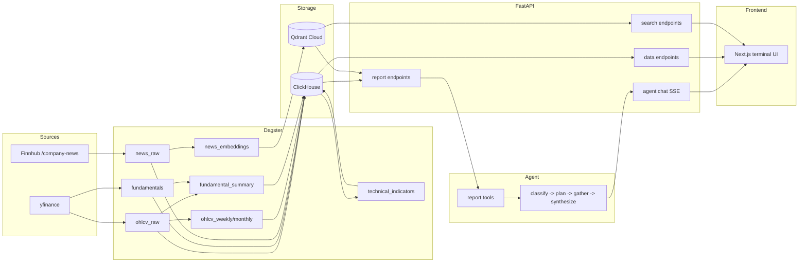

# Equity Data Agent - Project Requirements

Status: current production requirements. This document is the canonical
product and architecture spec — delivery history lives in
[`docs/project-plan.md`](project-plan.md), tradeoff history lives in
[`docs/decisions/`](decisions/), and post-phase lessons live in
[`docs/retros/`](retros/).

- Last reviewed: 2026-05-16
- Re-verify cadence: every phase retro (or sooner when an ADR lands that
  changes a contract here).

## 1. Executive Summary

Equity Data Agent is a production-style AI equity research platform for a
focused universe of US equities. It transforms market data, fundamentals, and
news into chart-ready data, human-readable reports, and streamed investment
analysis.

This is primarily a portfolio project demonstrating:

- Data engineering: scheduled ingestion, warehouse modeling, derived assets,
  idempotent migrations, and asset checks.
- AI engineering: report-grounded LangGraph agent, model routing, structured
  outputs, hallucination/provenance evals, and tracing.
- Full-stack product engineering: Next.js terminal UI, ticker detail pages,
  financial charting, persistent chat, and SSE streaming.
- Production operations: Hetzner backend, Vercel frontend, Cloudflare named
  tunnel, observability, alerts, deploy gates, and runbooks.

The central architectural thesis is **Intelligence vs. Math** (see
[ADR-003](decisions/003-intelligence-vs-math.md) for the rationale and
[ADR-012](decisions/012-domain-conventions-in-reports-not-prompts.md) for the
report-template extension):

| Layer | Responsibility | Technology |
|---|---|---|
| Calculation | Compute indicators, ratios, aggregates, embeddings | Dagster, Python, SQL |
| Interpretation | Format rows into report strings and frontend JSON | FastAPI |
| Reasoning | Synthesize answers from reports only | LangGraph, LLM |

The LLM does not calculate financial metrics. It reads report strings that
already contain computed values and cites those report sources in its answer.

## 2. Architectural Principles

These rules are non-negotiable.

### 2.1 Mathematical Isolation

All complex financial math must happen outside the LLM:

- Technical indicators: RSI, MACD, SMA, EMA, Bollinger Bands, ADX, ATR, OBV,
  MACD cross flags.
- Fundamental metrics: P/E, EV/EBITDA, P/B, P/S, EPS, margins, ROE, ROA, FCF
  yield, leverage, liquidity, TTM revenue, TTM net income, TTM FCF, YoY growth.
- Multi-timeframe bars: daily source bars aggregated to weekly and monthly.
- News embeddings and semantic search vectors.

FastAPI may compute trivial presentation values such as daily change percent,
RSI category labels, trend labels, and "next ingest" display strings. Those
values are still API outputs; they are not computed by the agent.

This principle is enforced as a measurable contract in
[§9.5 Numeric Provenance Contract](#95-numeric-provenance-contract).

### 2.2 Database Isolation

The agent must not access ClickHouse or Qdrant directly. It calls tools backed
by FastAPI endpoints. The only data the model sees is:

- User question.
- Ticker context.
- Report strings returned by FastAPI.
- System/developer prompts.

### 2.3 Role Distinction

| Component | Role | Owns |
|---|---|---|
| Dagster | Worker | Ingestion, transformations, schedules, sensors, checks |
| ClickHouse | Structured store | Raw and derived tabular data |
| Qdrant Cloud | Vector store | News embeddings and semantic search |
| FastAPI | Interpreter | Report endpoints, data endpoints, health, SSE chat route |
| LangGraph | Executive | Intent routing, tool planning, synthesis |
| Next.js | Presentation | Watchlist, ticker detail, charting, chat panel |

### 2.4 Idempotency

All ingestion and derived assets must be safe to re-run. ClickHouse tables use
`ReplacingMergeTree` with version columns such as `fetched_at` or
`computed_at`; repeated fetches converge to one current row after replacement.

### 2.5 Asset-Based Lineage

Data transformations must be Dagster software-defined assets, not anonymous
cron scripts. The lineage from raw source data to derived analytics must remain
visible in Dagster.

### 2.6 Ticker Scope

The production universe is intentionally small:

```text
NVDA, AAPL, MSFT, GOOGL, AMZN, META, TSLA, JPM, V, UNH
```

The canonical registry lives in `packages/shared/src/shared/tickers.py`.
Business logic should derive ticker lists from shared registry constants or
from the `/api/v1/tickers` endpoint. Avoid hardcoded ticker lists outside
fixtures and documentation examples.

## 3. System Architecture

### 3.1 High-Level Flow



### 3.2 Request Flow Example

When a user asks for an NVDA thesis:

1. The chat panel posts `{ticker: "NVDA", message: "..."}` to
   `/api/v1/agent/chat`.
2. The LangGraph graph classifies the intent.
3. The graph plans report tools. Thesis and comparison paths over-fetch; quick
   facts narrow to the smallest relevant set; focused analysis chooses the
   matching report family.
4. Tool wrappers call FastAPI report endpoints such as
   `/api/v1/reports/technical/NVDA`.
5. FastAPI reads ClickHouse and Qdrant, formats report strings, and returns
   text.
6. The graph synthesizes the response and streams SSE events back to the UI.

### 3.3 Package Boundaries

```text
shared              <- no internal dependencies
dagster-pipelines   <- shared
agent               <- shared; calls api over HTTP, never imports api
api                 <- shared + agent; runs the graph in-process for SSE
frontend            <- TypeScript app; calls FastAPI over HTTP
```

The `api -> agent` dependency is intentional. The public chat endpoint runs the
LangGraph graph in-process rather than operating a separate agent service.

## 4. Technical Stack

| Technology | Purpose | Rationale |
|---|---|---|
| Python 3.12 | Backend language | Data, API, and AI ecosystem depth |
| uv workspaces | Python package management | Fast installs and monorepo support |
| Dagster | Orchestration | Asset lineage, schedules, sensors, checks |
| ClickHouse | Structured warehouse | Fast OLAP reads, ReplacingMergeTree idempotency |
| Qdrant Cloud | Vector search | Managed news embeddings and semantic search |
| FastAPI | API layer | Pydantic-native, OpenAPI, SSE route |
| LangGraph | Agent graph | Controllable classify/plan/gather/synthesize flow |
| LiteLLM | Model routing | Provider swap behind one model alias |
| Groq | Default LLM provider | Free-tier fast inference for Llama models |
| Gemini 2.5 Flash | Override provider | Free-tier fallback/override path |
| Langfuse | Agent tracing | Model, token, span, and eval observability |
| Sentry | Error tracking | API and chat worker failure visibility |
| Next.js 16 | Frontend | App Router, SSG, Vercel-native deployment |
| TradingView Lightweight Charts | Charting | Financial candlestick and time-series rendering |
| Tailwind CSS | Styling | Consistent utility-first interface |
| Docker Compose | Backend deployment | Explicit single-host production topology |
| Vercel | Frontend hosting | CDN, previews, deploy hooks |
| Cloudflare named tunnel | HTTPS ingress | Stable API hostname without inbound public API port |

## 5. Repository Structure

Current high-level structure:

```text
equity-data-agent/
|-- pyproject.toml
|-- uv.lock
|-- Dockerfile
|-- docker-compose.yml
|-- dagster.yaml
|-- workspace.yaml
|-- litellm_config.yaml
|-- migrations/
|-- observability/
|-- scripts/
|-- docs/
|-- frontend/
|   |-- package.json
|   `-- src/
|       |-- app/
|       |   |-- layout.tsx
|       |   |-- page.tsx
|       |   `-- ticker/[symbol]/page.tsx
|       |-- components/
|       `-- lib/
|-- packages/
|   |-- shared/
|   |-- dagster-pipelines/
|   |-- api/
|   `-- agent/
`-- tests/
    |-- shared/
    |-- dagster/
    |-- api/
    |-- agent/
    `-- integration/
```

Important package responsibilities:

- `packages/shared`: settings, ticker registry, shared schemas.
- `packages/dagster-pipelines`: assets, resources, schedules, sensors,
  deployment helpers.
- `packages/api`: FastAPI app, routers, ClickHouse/Qdrant clients, report
  templates, public chat protections.
- `packages/agent`: LangGraph graph, tools, prompts, typed answer schemas,
  eval harness, tracing utilities.
- `frontend`: Next.js app with persistent shell, ticker detail, and chat.

## 6. Data Model

### 6.1 ClickHouse Databases

`equity_raw` contains source-like ingested data. `equity_derived` contains
rebuildable computed data.

All tables use `ReplacingMergeTree`. FastAPI queries must use `FINAL` where
duplicate replacement state would change user-visible results.

### 6.2 `equity_raw.ohlcv_raw`

Daily OHLCV bars from yfinance. SPY may be included in OHLCV-only benchmark
paths, but fundamentals and agent analysis are restricted to the 10 covered
equities.

Key columns:

```sql
ticker LowCardinality(String)
date Date
open Float64
high Float64
low Float64
close Float64
adj_close Float64
volume UInt64
fetched_at DateTime
```

Engine:

```sql
ReplacingMergeTree(fetched_at)
PARTITION BY ticker
ORDER BY (ticker, date)
```

### 6.3 `equity_raw.fundamentals`

Quarterly and annual statement data from yfinance.

Key columns:

```sql
ticker LowCardinality(String)
period_end Date
period_type LowCardinality(String)
revenue Float64
gross_profit Float64
net_income Float64
total_assets Float64
total_liabilities Float64
current_assets Float64
current_liabilities Float64
free_cash_flow Float64
ebitda Float64
total_debt Float64
cash_and_equivalents Float64
shares_outstanding UInt64
market_cap Float64
fetched_at DateTime
```

Statement fields are period-specific. Fields from `Ticker.info`, such as market
cap and shares outstanding, are point-in-time snapshots and must be interpreted
accordingly.

### 6.4 `equity_raw.news_raw`

Finnhub `/company-news` articles after per-ticker relevance filtering.

Current columns:

```sql
id UInt64
ticker LowCardinality(String)
headline String
body String
source String
url String
published_at DateTime
fetched_at DateTime
publisher_name LowCardinality(String)
image_url String
sentiment_label LowCardinality(String)
resolved_host LowCardinality(String)
```

Rows are keyed by ticker, publication time, and URL hash. Cross-mentioned URLs
are allowed to exist once per ticker.

### 6.5 Derived OHLCV Tables

`equity_derived.ohlcv_weekly` and `equity_derived.ohlcv_monthly` are derived
from daily OHLCV. They are not fetched separately.

Aggregation rules:

- `open`: first bar in period.
- `close`: last bar in period.
- `adj_close`: last adjusted close in period.
- `high`: max.
- `low`: min.
- `volume`: sum.
- Skip incomplete current periods where required to avoid distorted indicators.

### 6.6 Technical Indicator Tables

Technical indicators exist for daily, weekly, and monthly timeframes.

Core columns:

```sql
sma_20 Nullable(Float64)
sma_50 Nullable(Float64)
sma_200 Nullable(Float64)
ema_12 Nullable(Float64)
ema_26 Nullable(Float64)
rsi_14 Nullable(Float64)
macd Nullable(Float64)
macd_signal Nullable(Float64)
macd_hist Nullable(Float64)
macd_bullish_cross UInt8
bb_upper Nullable(Float64)
bb_middle Nullable(Float64)
bb_lower Nullable(Float64)
bb_pct_b Nullable(Float64)
adx_14 Nullable(Float64)
atr_14 Nullable(Float64)
obv Nullable(Float64)
computed_at DateTime
```

Warm-up periods emit rows with null indicators. Consumers must render nulls as
insufficient data, not as zero.

### 6.7 `equity_derived.fundamental_summary`

Computed ratios and TTM aggregates:

```sql
pe_ratio Nullable(Float64)
ev_ebitda Nullable(Float64)
price_to_book Nullable(Float64)
price_to_sales Nullable(Float64)
eps Nullable(Float64)
revenue_yoy_pct Nullable(Float64)
net_income_yoy_pct Nullable(Float64)
fcf_yoy_pct Nullable(Float64)
net_margin_pct Nullable(Float64)
gross_margin_pct Nullable(Float64)
ebitda_margin_pct Nullable(Float64)
gross_margin_bps_yoy Nullable(Float64)
net_margin_bps_yoy Nullable(Float64)
roe Nullable(Float64)
roa Nullable(Float64)
fcf_yield Nullable(Float64)
debt_to_equity Nullable(Float64)
current_ratio Nullable(Float64)
revenue_ttm Nullable(Float64)
net_income_ttm Nullable(Float64)
fcf_ttm Nullable(Float64)
computed_at DateTime
```

Financial display conventions:

- P/E should be null/NM when EPS is near zero.
- Quarterly P/E should use TTM earnings, not single-quarter annualized EPS.
- Frontend quarterly views may present TTM P/E, ROE, ROA, and FCF yield where
  that matches market convention.

### 6.8 Qdrant Collection

Collection: `equity_news`

Requirements:

- Embedding model: Qdrant Cloud Inference using
  `sentence-transformers/all-minilm-l6-v2`.
- Vector dimension: 384.
- Distance: cosine.
- Point ID: deterministic hash namespaced by ticker and article URL id.
- Payload: ticker, published timestamp, URL, headline, source/publisher fields.
- Re-embed window: trailing recent news window per ticker.

## 7. Dagster Requirements

### 7.1 Assets

Core asset groups:

- `ohlcv_raw`: yfinance OHLCV ingestion.
- `fundamentals`: yfinance financial statement ingestion.
- `ohlcv_weekly` and `ohlcv_monthly`: multi-timeframe aggregation.
- `technical_indicators`: daily, weekly, and monthly indicator computation.
- `fundamental_summary`: derived financial ratios and TTM metrics.
- `news_raw`: Finnhub news ingestion and relevance filtering.
- `news_embeddings`: ClickHouse news rows to Qdrant vectors.

### 7.2 Partitioning

Per-ticker assets should use `StaticPartitionsDefinition` over the supported
ticker universe. The run coordinator and tags must prevent unbounded fan-out on
the single-host production box (see QNT-114 / QNT-116 ghost-run incident and
[ADR-010](decisions/010-dagster-production-topology.md) for the production
topology choice).

### 7.3 Schedules And Sensors

Required recurring work:

- Daily OHLCV ingestion after US market close.
- Downstream recomputation for derived OHLCV, indicators, and price-dependent
  fundamental summaries.
- Weekly fundamentals refresh.
- News ingestion and embedding refresh.
- Vercel deploy hook after successful freshness-driving ingest cycles.

Schedules and sensors should default to running in code where production
expects them to be active.

### 7.4 Asset Checks

Asset checks should validate both shape and domain expectations:

- Row counts and freshness.
- No future dates.
- OHLCV sanity: valid prices and volumes.
- Indicator bounds: RSI 0-100, coherent MACD/signal fields, valid null warm-up
  behavior.
- Fundamental domain bounds: margins, P/E bands, TTM aggregates, no divide-by
  zero artifacts.
- News integrity: headline/URL presence, publisher fields, pending sentiment
  age.
- Qdrant integrity: vector dimension, vector count, no orphan points.

Checks that catch real financial calibration issues should be preserved, not
watered down into generic smoke tests.

## 8. FastAPI Requirements

### 8.1 Application

FastAPI serves four categories:

- Report endpoints for the agent.
- JSON data endpoints for the frontend.
- Search endpoints for semantic news.
- Public chat SSE endpoint that runs the agent graph.

The app also owns health, CORS, Sentry initialization, rate-limit handling, and
startup cache warming.

### 8.2 Report Endpoints

Reports are plain text consumed by the agent:

- `GET /api/v1/reports/company/{ticker}`
- `GET /api/v1/reports/technical/{ticker}`
- `GET /api/v1/reports/fundamental/{ticker}`
- `GET /api/v1/reports/news/{ticker}`
- `GET /api/v1/reports/summary/{ticker}`

Report requirements:

- Structured sections, not walls of prose.
- Explicit source/report family naming.
- Numeric values printed in stable formats so evals can compare generated
  answers against report text.
- Domain context such as RSI 70/30 and valuation bands must live in templates,
  not in the system prompt.
- Missing data should produce a useful report string instead of an exception
  where possible.

### 8.3 Data Endpoints

Frontend-facing endpoints:

- `GET /api/v1/dashboard/summary`
- `GET /api/v1/ohlcv/{ticker}?timeframe=daily|weekly|monthly`
- `GET /api/v1/indicators/{ticker}?timeframe=daily|weekly|monthly`
- `GET /api/v1/fundamentals/{ticker}`
- `GET /api/v1/news/{ticker}?days={n}&limit={n}`
- `GET /api/v1/quote/{ticker}`
- `GET /api/v1/logos`
- `GET /api/v1/tickers`
- `GET /api/v1/health`

Data endpoint requirements:

- Validate tickers against the shared registry or OHLCV-specific registry.
- Use parameterized ClickHouse queries.
- Use `FINAL` on ReplacingMergeTree tables when consistent user-visible reads
  require it.
- Convert date/datetime objects to ISO strings.
- Preserve nulls for unavailable financial values.
- Return 404 for unknown ticker paths.

### 8.4 Search Endpoint

`GET /api/v1/search/news`

Requirements:

- Filter by ticker.
- Limit result count.
- Use Qdrant semantic search over the same embedding space as ingestion.
- Return empty results for no matches or degraded vector search paths where the
  UI should not distinguish outage from empty state.

### 8.5 Health Endpoint

`GET` and `HEAD` must be supported for both:

- `/api/v1/health`
- `/health`

Payload requirements:

```json
{
  "status": "ok | degraded | down",
  "services": {
    "clickhouse": "ok | down",
    "qdrant": "ok | down"
  },
  "deploy": {
    "git_sha": "string",
    "dagster_assets": 0,
    "dagster_checks": 0
  },
  "provenance": {
    "sources": ["yfinance", "Finnhub", "Qdrant"],
    "jobs": {
      "runtime": "Dagster",
      "schedule": "daily",
      "next_ingest_local": "17:00 ET"
    }
  }
}
```

Status semantics:

- `ok`: ClickHouse and Qdrant reachable.
- `degraded`: ClickHouse reachable, Qdrant unavailable.
- `down`: ClickHouse unavailable. HTTP status should be 503.

## 9. Agent Requirements

### 9.1 Graph Shape

The graph is linear:

```text
classify -> plan -> gather -> synthesize
```

### 9.2 Supported Intents

Supported response shapes:

- `thesis`: setup, bull case, bear case, verdict.
- `quick_fact`: short answer with one cited value.
- `comparison`: two covered tickers, side-by-side cited values, differences.
- `conversational`: greeting, capability answer, or off-domain redirect.
- `fundamental`: focused fundamental analysis.
- `technical`: focused technical analysis.
- `news_sentiment`: focused news/sentiment analysis.

### 9.3 Tool Surface

Default report tools:

- `company`
- `technical`
- `fundamental`
- `news`

The graph should accept tools as an injected mapping so unit tests can run
offline with fakes.

### 9.4 Failure Behavior

Required behavior:

- Classifier failures default to thesis.
- Conversational path skips tool gathering.
- Optional news failures should not crash broad thesis generation.
- Required report failures are surfaced as degraded state or client-visible
  tool errors without leaking raw internal exception detail.
- Any synthesize failure must produce a deterministic conversational fallback
  instead of a blank panel.
- Top-level chat timeout must stop streaming and emit a stable user-facing
  timeout error.

### 9.5 Numeric Provenance Contract

The agent should not introduce numeric financial claims that are absent from
retrieved report strings. The eval harness extracts numeric literals from
generated answers and compares them to the tool-output reports.

This is the measurable form of the
[§2.1 Mathematical Isolation](#21-mathematical-isolation) principle: §2.1
defines where math is allowed to happen; §9.5 defines how that boundary is
checked behaviourally.

This is a provenance guarantee, not a claim that the model always chooses the
best number for the question. Correctness is tracked separately by judge scores
and golden-set evaluation.

## 10. Public Chat Abuse Controls

`POST /api/v1/agent/chat` is public by design. There is no login or API key for
the portfolio demo — see
[ADR-017](decisions/017-public-chat-truly-public-no-auth.md) for the threat
model and why auth was rejected.

Required controls:

| Control | Requirement |
|---|---|
| CORS | Explicit allowed origins plus project-pinned Vercel preview regex |
| Rate limit | Per-IP SlowAPI moving-window limits |
| Token budget | Per-IP daily and global daily token counters |
| Fail closed | LiteLLM aliases on chat path must stay on free-tier providers |
| Input filter | Reject control characters and overlong tokens |
| Alerts | Burst 429s and global breaker trips should reach Sentry/logs |
| Safe errors | Client must see stable messages, not raw provider/internal errors |

Budget exhaustion should return a normal SSE conversational redirect, not an
HTTP 500 and not an LLM call.

## 11. Frontend Requirements

### 11.1 Product Shell

The UI is a three-pane terminal-style workspace:

- Left: watchlist.
- Center: route slot.
- Right: persistent chat panel.

The chat panel must persist across ticker navigation so in-flight SSE streams
are not torn down by route changes.

### 11.2 Routes

Required routes:

- `/`: landing/empty center state.
- `/ticker/[symbol]`: ticker detail page.

Chat lives as a persistent panel in the root layout, not on a dedicated route,
so SSE streams survive ticker navigation.

### 11.3 Ticker Detail

Ticker detail must include:

- Quote header with logo, sector/industry context, price, daily range, volume,
  market cap, and P/E.
- Price chart with OHLCV and indicator support.
- Technicals card.
- Fundamentals card.
- News card.
- Provenance strip.

### 11.4 Rendering And Freshness

Rendering model (see
[ADR-014](decisions/014-nextjs-rendering-mode-per-page.md) for the per-page
mode choice):

- Ticker detail pages are statically rendered.
- `generateStaticParams()` reads the canonical ticker universe from the API.
- Freshness is driven by Vercel deploy hooks after ingest cycles.
- Client-side interactive fetches may use `cache: "no-store"` where needed.
- Server-side fetches must declare cache behavior explicitly.

### 11.5 Chat UI

Chat requirements:

- Reads active ticker from the route.
- Sends `POST /api/v1/agent/chat` requests.
- Parses SSE frames without the Vercel AI SDK.
- Renders tool calls/results, prose chunks, structured thesis, quick fact,
  comparison, conversational, and focused payloads.
- Provides useful cold-start and fallback suggestions.
- Handles rate-limit, timeout, and unknown-ticker errors gracefully.

## 12. Infrastructure Requirements

### 12.1 Local Development

Expected local services:

- FastAPI: `localhost:8000`
- Next.js: `localhost:3001`
- Dagster UI: `localhost:3000`
- LiteLLM: `localhost:4000`
- ClickHouse: local compose profile or SSH tunnel to Hetzner

Useful Make targets:

- `make setup`
- `make dev-api`
- `make dev-frontend`
- `make dev-dagster`
- `make dev-litellm`
- `make tunnel`
- `make test`
- `make lint`

### 12.2 Production Backend

Production backend runs on Hetzner CX41 using Docker Compose.

Long-running services:

- `clickhouse`
- `dagster-code-server`
- `dagster`
- `dagster-daemon`
- `api`
- `litellm`
- `cloudflared`
- observability stack services

Dagster production topology:

- User code loads in `dagster-code-server`.
- Webserver and daemon communicate with the code server via workspace config.
- Run workers are launched through DockerRunLauncher.
- Run monitoring must remain enabled to recover orphaned runs.

### 12.3 Production Frontend

Vercel hosts the frontend. It reads `NEXT_PUBLIC_API_URL` from environment
configuration and calls the backend through the Cloudflare named tunnel.

### 12.4 Ingress

FastAPI is not exposed through a public host port. Cloudflare named tunnel
connects outbound from the backend host and exposes `api.<domain>` over HTTPS.
See [ADR-018](decisions/018-cloudflare-quick-tunnel-for-https-ingress.md) for
the ingress choice and the QNT-177 migration that moved from quick tunnel to
named tunnel.

Port policy:

- Public inbound: SSH only.
- Host loopback: FastAPI, Dagster UI, ClickHouse for local/tunnel access.
- Docker network only: LiteLLM and internal service-to-service traffic.

### 12.5 Deployment Gates

Production deploys must include the following gates. Each was paid for by a
specific incident — see Phase 2 and Phase 3 retros for the originating
failures:

- SOPS decrypt for secrets.
- Git SHA identity check (catches "deploy succeeded but prod runs old code"
  — Phase 2 retro / QNT-88, QNT-89).
- Docker Compose build/up.
- Idempotent ClickHouse migrations.
- API health loop.
- Dagster definitions-load gate (catches "code-server up but graph broken"
  — Phase 3 retro).
- Config bind-mount restart handling (catches stale config from named-volume
  shadowing — QNT-110 / QNT-112).
- Observability smoke checks for infra/observability changes (catches
  "shipped infra, every signal green, nothing actually working" — QNT-103
  obs follow-up).

## 13. LLM Routing And Evaluation

### 13.1 Routing

The agent references a LiteLLM model alias, not provider-specific model names.
See [ADR-011](decisions/011-llm-routing-groq-default-gemini-override.md) for
the routing decision (Groq default, Gemini override).

Current production pattern:

- Default: Groq Llama-3.3-70B.
- Groq fallback: Llama-4-Scout-17B.
- Optional override: Gemini 2.5 Flash.
- Bench aliases: available for eval comparisons.

The public chat path must remain fail-closed to free-tier providers. Tests
should fail if a paid fallback is added to the reachable alias chain.

### 13.2 Evaluation

The eval harness must preserve:

- Golden questions covering all supported response shapes.
- Tool-call correctness checks.
- Numeric provenance/hallucination checks.
- Judge/correctness signal.
- History CSV for model and prompt comparisons.

README-level model benchmark tables should be updated only when the benchmark
set or production default changes.

## 14. Observability And Operations

Required observability layers:

| Layer | Tooling | Answers |
|---|---|---|
| Logs | Dozzle, Docker logs | What did services print? |
| Metrics | Prometheus, Grafana, cAdvisor, node_exporter | What is resource health? |
| Errors | Sentry | Which API/chat failures happened? |
| Traces | Langfuse | What did the agent do? |
| Orchestration | Dagster UI | Which assets, checks, runs, schedules failed? |

Required alert paths:

- External uptime probe on `/api/v1/health`.
- Docker event notifications.
- Dagster run-failure sensor.
- Grafana alert rules for memory, disk, and restarts.
- Sentry alerts for chat burst and global breaker patterns.

Operational docs:

- Failure-mode catalog: `docs/guides/ops-runbook.md`
- Vercel/Cloudflare deploy guide: `docs/guides/vercel-deploy.md`
- Local development setup: `docs/guides/local-dev-setup.md`
- Uptime monitoring: `docs/guides/uptime-monitoring.md`

## 15. Quality And Security Gates

### 15.1 Backend

Required checks:

- `ruff check`
- `pyright`
- `pytest`
- integration tests where ClickHouse is available

### 15.2 Frontend

Required checks:

- `npm run lint`
- `npm run typecheck`
- targeted unit tests where present

Frontend browser behavior is validated through manual review and Vercel preview
deploys at this project scale.

### 15.3 Security

Required scanner suite:

- `pip-audit`
- `bandit`
- `gitleaks`
- `npm audit --audit-level=high`
- Trivy image scans

Secrets must stay out of git. Production secrets are SOPS-encrypted and
decrypted during deploy.

## 16. Data Governance

### 16.1 Batch-Only Ingestion

The system is not a real-time trading system. It uses batch ingestion:

- OHLCV after market close.
- Fundamentals on a slower cadence.
- News on a scheduled cadence.

This avoids unnecessary streaming infrastructure for the current scope.

### 16.2 Backfill And Incremental Strategy

| Mode | Purpose | Behavior |
|---|---|---|
| Backfill | Initial seed or rebuild | Materialize ticker partitions over a larger historical window |
| OHLCV incremental | Daily freshness | Fetch recent days; ReplacingMergeTree deduplicates overlap |
| Fundamentals incremental | Statement refresh | Fetch available quarterly/annual periods; deduplicate overlap |
| News incremental | Narrative freshness | Fetch recent Finnhub articles; relevance filter and deduplicate |

### 16.3 Retention

At the current 10-ticker scale:

- Raw OHLCV can be kept indefinitely.
- Raw fundamentals can be kept indefinitely.
- Raw news can be kept indefinitely unless Qdrant or ClickHouse cost changes.
- Derived ClickHouse tables are rebuildable from raw tables.
- Qdrant vectors are rebuildable from `news_raw`.

### 16.4 Source Caveats

The project uses free/low-cost data sources. It is a portfolio research tool,
not a licensed market-data product. Documentation and UI should avoid implying
real-time or institutional data entitlements.

## 17. Graceful Degradation

| Failure | Expected behavior |
|---|---|
| yfinance rate limit or timeout | Dagster retries; frontend continues showing last-known-good data |
| Finnhub failure | News becomes older or sparse; price and fundamentals continue |
| Qdrant unavailable | Health degrades; search/news semantic paths degrade |
| ClickHouse unavailable | Health down; warehouse-backed endpoints fail |
| LLM provider unavailable | Chat emits stable friendly error or deterministic fallback |
| Token budget exhausted | Chat emits demo-limit conversational redirect without LLM call |
| Unknown ticker | API returns 404 or chat emits unknown-ticker SSE error |
| Empty data during fresh install | Endpoints return empty arrays or clear report messages where appropriate |

No user-facing path should expose raw stack traces, provider secrets, internal
URLs, or unbounded exception messages.

## 18. Production Bootstrap

For a fresh deployment:

1. Provision Hetzner host and install Docker, Compose, git, and required system
   packages.
2. Clone the repo under `/opt/equity-data-agent`.
3. Configure SOPS/age secrets and production `.env` values.
4. Configure Cloudflare named tunnel and set `CLOUDFLARE_TUNNEL_TOKEN`.
5. Configure Vercel project and `NEXT_PUBLIC_API_URL`.
6. Start backend services with the `prod` profile.
7. Run idempotent migrations.
8. Backfill OHLCV and fundamentals through Dagster.
9. Materialize downstream derived assets.
10. Verify health, dashboard summary, ticker pages, chat, alerts, and traces.

Detailed procedural steps belong in `docs/guides/hetzner-bootstrap.md` and
`docs/guides/vercel-deploy.md`; this section defines the required outcomes.

## 19. Documentation Ownership

Documentation roles:

- `README.md`: public project story and reviewer path.
- `docs/project-requirement.md`: current product and architecture requirements.
- `docs/architecture/system-overview.md`: concise system reference.
- `docs/decisions/`: durable ADRs and tradeoffs.
- `docs/project-plan.md`: delivery history.
- `docs/retros/`: phase retrospectives and lessons.
- `docs/guides/`: operational procedures.
- `docs/patterns.md`: implementation recipes and repo conventions.

When current production behavior changes, update this file and the relevant
ADR/runbook together.
